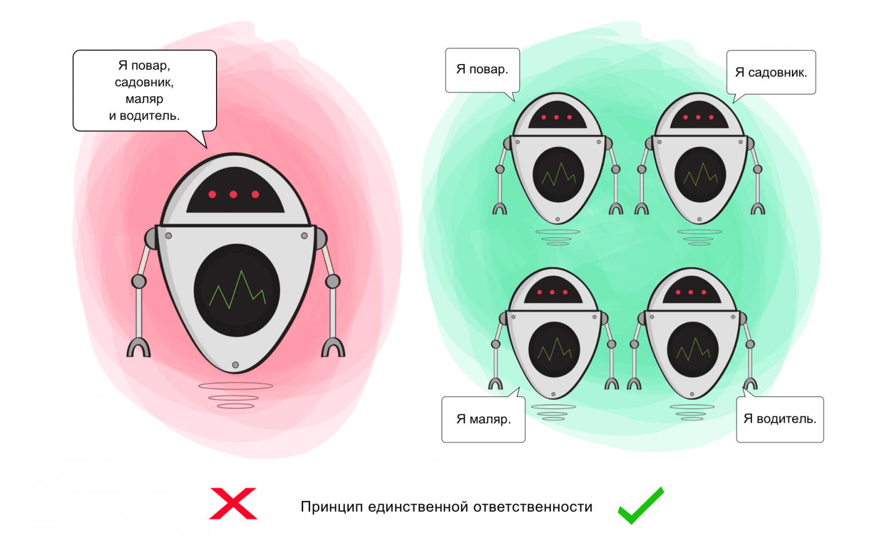
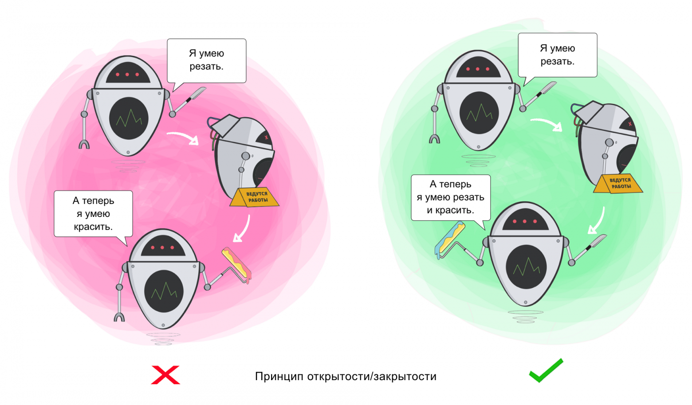
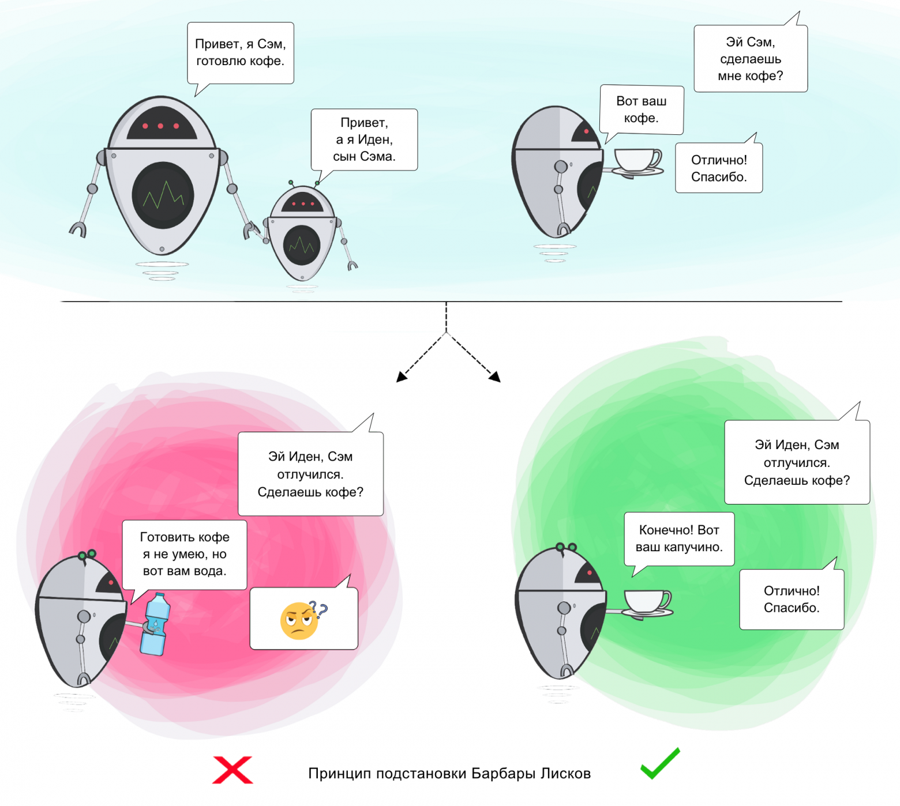
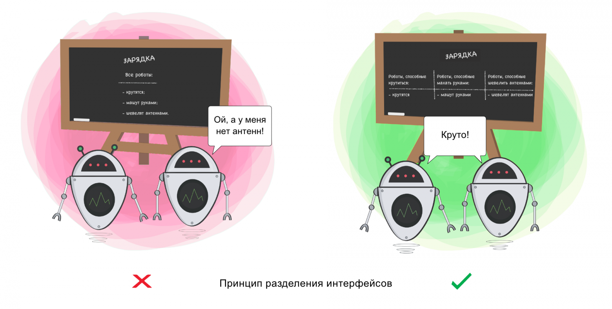
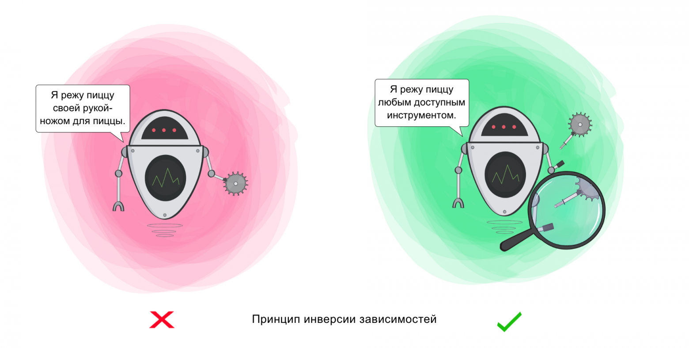
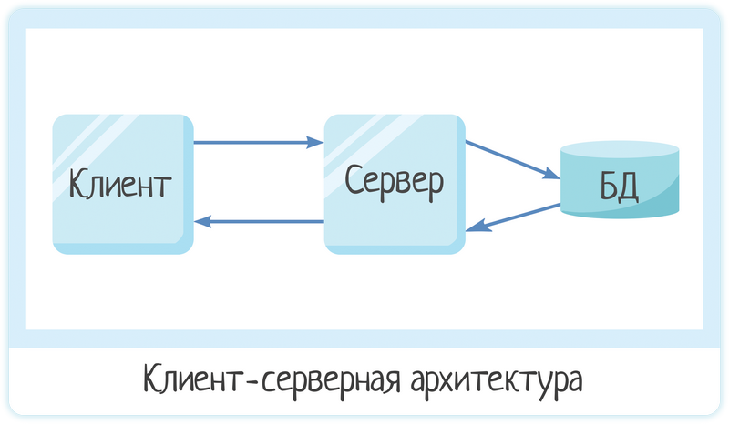
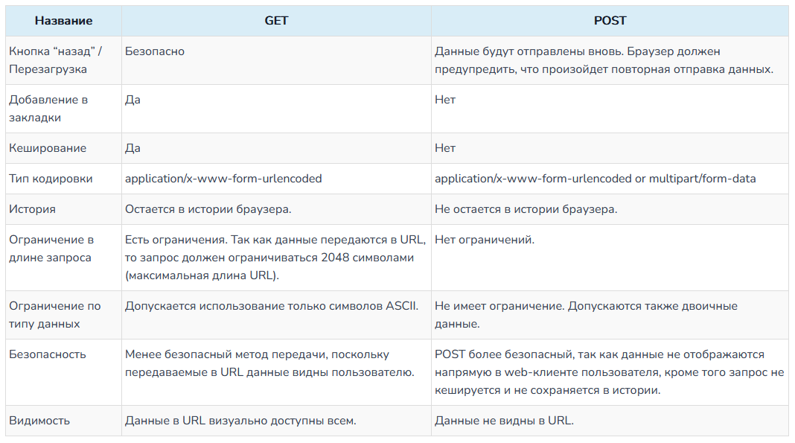

# **Теория тестирования**

## **Тестирование**
*Тестирование ПО (Software Testing)* - проверка соответствия между реальным и ожидаемым поведением программы, осуществляемая на конечном наборе тестов, выбранном определенным образом.


## **Пирамида тестирования**


## **Зачем тестировать ПО**
*Цели тестирования*:
* Повысить вероятность того, что приложение, будет работать правильно при любых обстоятельствах.
* Повысить вероятность того, что приложение, будет соответствовать всем описанным требованиям.
* Предоставление актуальной информации о состоянии продукта на данный момент.


## **Этапы тестирования**
*Этапы*:
1. Анализ продукта
2. Работа с требованиями
3. Разработка стратегии тестирования
и планирование процедур контроля качества
4. Создание тестовой документации
5. Тестирование прототипа
6. Основное тестирование
7. Стабилизация
8. Эксплуатация


## **Типы тестирования**
*По целям*:
* Безопасности
* Функциональное
* Нефункциональное
  * UI
  * Совместимости
  * Производительности
    * Нагрузочное
    * Стабильности
    * Стресс

*По знанию системы*:
* Белый ящик
* Серый ящик
* Чёрный ящик

*По хронологии выполнения*:
* Входное (Smoke/intake)
* Повторное
* Регрессионное

*По степени автомтизации*

*По исполнению кода*


## **Уровни тестирования**
* *Модульное/Компонентное* (unit/component testing)* - тестирование наименьших элементов ПО, которые могут быть протестированы по-отдельности (модули, объекты, классы, функции).  
Задача модульного тестирования - выявление локализованных в модуле ошибок реализации алгоритмов, а также определение степени готовности системы к переходу на следующий уровень разработки и тестирования.

* *Интеграционное (integration testing)* - тестирование части системы, состоящей из двух и более модулей.  
Задача интеграционного тестирования - поиск дефектов, связанных с ошибками реализации и интерпретации интерфейсного взаимодействия между модулями, а также ошибок взаимодействия с другими частями системы (ОС, оборудованием).

* *Системное (system testing)* - процесс тестирования системы в целом с целью проверки того, что она соответствует установленным требованиям.  
Задача системного тестирования - выявление дефектов, связанных с общей работой системы, таких как неверное использование ресурсов системы, непредусмотренные комбинации данных пользовательского уровня, несовместимость с окружением, непредусмотренные сценарии использования, отсутствующая или неверная функциональность, неудобство в применении и т.д.

* *Приёмочное (acceptance testing)* - формальный процесс тестирования, который проверяет соответствие системы потребностям, требованиям и бизнес процессам пользователя, и проводится для вынесения решения заказчиком (внутренним или внешним) или другим уполномоченным лицом принимается приложение или нет.


## **Техники тест-дизайна**
* *Эквивалентное Разделение/Классы эквивалентности (Equivalence Partitioning — EP)*. Как пример, у вас есть диапазон допустимых значений от 1 до 10, вы должны выбрать одно верное значение внутри интервала, скажем, 5, и одно неверное значение вне интервала — 0, получив таким образом два значения относящиеся к разным классам.

* *Анализ Граничных Значений (Boundary Value Analysis — BVA)*. Если взять пример выше, в качестве значений для позитивного тестирования выберем минимальную и максимальную границы (1 и 10), и значения больше и меньше границ (0 и 11). Анализ Граничный значений может быть применен к полям, записям, файлам, или к любого рода сущностям имеющим ограничения.  
*Ценность: ошибки часто встречаются как раз на границах разных групп значений*.

* *Попарное тестирование (Pairwise Testing)* — техника формирования наборов тестовых данных. Сформулировать суть можно так: формирование таких наборов данных, в которых каждое тестируемое значение каждого из проверяемых параметров хотя бы единожды сочетается с каждым тестируемым значением всех остальных проверяемых параметров.

* *Причина/Следствие (Cause/Effect — CE)*. Это, как правило, ввод комбинаций условий (Причин), для получения ответа от системы (Следствие). Например, вы проверяете возможность добавлять клиента, используя определенную экранную форму. Для этого вам необходимо будет ввести несколько полей, таких как «Имя», «Адрес», «Номер Телефона» а затем, нажать кнопку «Добавить» — это «Причина». После нажатия кнопки «Добавить», система добавляет клиента в базу данных и показывает его номер на экране — это «Следствие».

* *Предугадывание ошибки (Error Guessing — EG)*. Это когда тестировщик использует свои знания системы и способность к интерпретации спецификации на предмет того, чтобы «предугадать» при каких входных условиях система может выдать ошибку. Например, спецификация говорит: «пользователь должен ввести код». Тестировщик будет думать: «Что, если я не введу код?», «Что, если я введу неправильный код? », и так далее. Это и есть предугадывание ошибки.

* *Исчерпывающее тестирование (Exhaustive Testing — ET)* — крайний случай. В пределах этой техники вы должны проверить все возможные комбинации входных значений, и в принципе, это должно найти все проблемы. На практике применение этого метода не представляется возможным, из-за огромного количества входных значений.


## **Что такое Regression и Confirmation тестирование, какая между ними разница**
*Повторное/Подтверждающее тестирование (re-testing/confirmation testing)* - тестирование, во время которого исполняются тестовые сценарии, выявившие ошибки во время последнего запуска, для подтверждения успешности исправления этих ошибок.

*Регрессионное тестирование (regression testing)* - тестирование уже протестированной программы после модификации для уверенности в том, что процесс модификации не внес или не активизировал ошибки в областях, не подвергавшихся изменениям. Проводится после изменений в коде ПО или его окружения.


## **Частота регрессионного тестирования**
Стоит делать по возможности и в зависимости от частоты вмешательства в релизы.


## **Виды интеграционного тестирования**
* *Снизу вверх (Bottom Up Integration)*. Все низкоуровневые модули, процедуры или функции собираются воедино и затем тестируются. После чего собирается следующий уровень модулей для проведения интеграционного тестирования. Данный подход считается полезным, если все или практически все модули, разрабатываемого уровня, готовы. Также данный подход помогает определить по результатам тестирования уровень готовности приложения.

* *Сверху вниз (Top Down Integration)*. Вначале тестируются все высокоуровневые модули, и постепенно один за другим добавляются низкоуровневые. Все модули более низкого уровня симулируются заглушками с аналогичной функциональностью, затем по мере готовности они заменяются реальными активными компонентами. Таким образом мы проводим тестирование сверху вниз.

* *Большой взрыв («Big Bang» Integration)*. Все или практически все разработанные модули собираются вместе в виде законченной системы или ее основной части, и затем проводится интеграционное тестирование. Такой подход очень хорош для сохранения времени. Однако если тест кейсы и их результаты записаны не верно, то сам процесс интеграции сильно осложнится, что станет преградой для команды тестирования при достижении основной цели интеграционного тестирования.


## **Configuration Testing**
*Конфигурационное тестирование (configuration testing)* - тестирование, направленное на проверку работы ПО при различных конфигурациях системы (заявленных платформах, поддерживаемых драйверах, при различных конфигурациях компьютеров и системного ПО и т.д.).


## **Exploratory Testing**
*Исследовательское тестирование (exploratory testing)* - неформальный метод, при котором тестировщик активно контролирует проектирование тестов, в то время как эти тесты выполняются, и использует полученную информацию для проектирования новых улучшенных тестов. Такое тестирование определяется как одновременное обучение, проектирование теста и его исполнение.


## **Black/Grey/White Box Testing**
* *Тестирование белого ящика (white box testing)* - тестирование, основанное на анализе внутренней структуры компонента или системы и на знании исходного кода, к которому тестировщик (как правило, это программист) имеет полный доступ.

* *Тестирование серого ящика (gray box testing)* - тестирование, ориентированное на имитацию работы пользователей, в условиях, когда часть внутренней структуры программы известна.

* *Тестирование чёрного ящика (black box testing)* - тестирование, основанное на анализе функциональной или нефункциональной спецификации системы, при котором программа рассматривается как объект, внутренняя структура которого неизвестна.


## **Performance Testing**
*Тестирование производительности (performance testing)* - определение степени, с которой система выполняет заложенные в нее функции в установленных рамках на время обработки и пропускную способность. Достаточно часто при тестировании производительности проверяется сразу несколько его подвидов.


## **Smoke и Sanity тестирование и какая между ними разница**
*Санитарное тестирование или проверка согласованности/исправности (sanity testing)* - узконаправленное тестирование достаточное для доказательства того, что конкретная функция работает согласно заявленным в спецификации требованиям. Является подмножеством регрессионного тестирования. Используется для определения работоспособности определенной части приложения после изменений произведенных в ней или окружении. Обычно выполняется вручную.

*Дымовое/входное тестировние (smoke/intake test)* - специальный тест (короткий цикл тестов) для принятия решения, готов ли компонент или система для дальнейшего детального тестирования. Выполняется для подтверждения того, что после сборки кода (нового или исправленного) приложение, стартует и выполняет основные функции.


## **Traceability Matrix**
*Матрица соответствия требований (traceability matrix)* — двумерная таблица, содержащая соответсвие функциональных требований (functional requirements) продукта и подготовленных тестовых сценариев (test cases).  
В заголовках колонок таблицы расположены требования, а в заголовках строк — тестовые сценарии. На пересечении — отметка, означающая, что требование текущей колонки покрыто тестовым сценарием текущей строки.  
Матрица соответсвия требований используется QA-инженерами для валидации покрытия продукта тестами. МСТ является неотъемлемой частью тест-плана.


## **End-to-End тест**
End-to-End тесты - такие интеграционные тесты, которые воздействуют на систему через ее самые внешние интерфейсы и проверяют ожидаемую реакцию системы через эти же интерфейсы.  
Почему именно интеграционные? Потому, что это единственное, что можно о них сказать наверняка: они по определению не могут быть модульными тестами. А все остальное: являются ли они одновременно приемочными, нагрузочными или еще какими - зависит только от общих плана/стратегии тестирования и той роли, которые эти тесты в них играют.


## **Тестирование безопасности**
*Тестирование безопасноcти/защищённости (security testing)* – тестирование ПО с целью определить его защищённость.  
Основные понятия, которые должны быть охвачены тестированием: конфиденциальность, целостность и сохранность данных, аутентификация, авторизация и невозможность отказа от авторства.


## **Испытание на основе рисков**
*Тестирование на основе рисков/Риск-тестирование (risk-based testing)* — метод тестирования ПО, который базируется на вероятности рисков. Их вероятность определяется путем анализа, в котором учитываются сложность программы, критичность функции для бизнеса, частота ее использования и количество возможных дефектов. При тестировании на основе рисков наибольший приоритет получает проверка самых важных и потенциально имеющих недостатки функций.


## **Динамическое тестирование**
*Динамическое тестирование (dynamic testing)* - тестирование, проводимое во время выполнения ПО, компонента или системы.


## **«Парадокс пестицида»**
Парадокс пестицида - эффект, при котором при регулярном прогоне тестовых сценариев ошибки перестают находиться. Происходит из-за того, что ошибки которые ловились данными тестами уже пойманы, а остальные оказываются не попадающими в тестовые сценариями.


## **Основные фазы STLC? Дайте определение Entry и Exit Criteria.**
Жизненный цикл тестирования ПО(STLC) определяет, какие действия выполнять при тестировании и когда их выполнять.

**Фазы**:
1. Анализ требований
2. Планирование тестирования
3. Дизайн теста
4. Настройка тестовой среды
5. Выполнение теста
6. Завершение теста 

*Критерии входа (Entry Criteria)* - содержат обязательные элементы, которые необходимо выполнить, прежде чем можно будет начать тестирование.

*Критерии выхода (Exit Criteria)* - определяют элементы, которые должны быть выполнены до завершения тестирования.


## **Что такое Bug, Error, Failure, Fault**
*Bug (defect/fault)* — ошибка программиста (или дизайнера или ещё кого, кто принимает участие в разработке), то есть когда в программе, что-то идёт не так как планировалось и программа выходит из-под контроля. Например, когда никак не контроллируется ввод пользователя, в результате неверные данные вызывают краши или иные «радости» в работе программы. Либо внутри программа построена так, что изначально не соответствует тому, что от неё ожидается.

*Error* — ошибка пользователя, то есть он пытается использовать программу иным способом.
Пример — вводит буквы в поля, где требуется вводить цифры (возраст, количество товара и т.п.).
В качественной программе предусмотрены такие ситуации и выдаются сообщение об ошибке (error message).

*Failure* — сбой (причём не обязательно аппаратный) в работе компонента, всей программы или системы. То есть, существуют такие дефекты, которые приводят к сбоям (A defect caused the failure) и существуют такие, которые не приводят. UI-дефекты например. Но аппаратный сбой, никак не связанный с software, тоже является failure.


## **Атрибуты баг-репорта? Какие основные поля для заполнения**
*Баг Репорт (Bug Report)* — документ, описывающий ситуацию или последовательность действий приведшую к некорректной работе объекта тестирования, с указанием причин и ожидаемого результата.

**Атрибуты**:
* Короткое описание (Summary/Title) - выжимка информации явно указывающая на причину и тип проблемы.
* Номер версии (Version) - версия на которой была найдена ошибка
* Серьезность (Severity):
  * S1 Блокирующий (Blocker)
  * S2 Критический (Critical)
  * S3 Значительный (Major)
  * S4 Незначительный (Minor)
  * S5 Тривиальный (Trivial)
* Приоритет (Priority):
  * P1 Высокий (High)
  * P2 Средний (Medium)
  * P3 Низкий (Low)
* Статус (Status) - текущий статус бага. Зависит от используемой процедуры и жизненного цикла бага (bug workflow and life cycle)
* Окружение (Environment) - ОС / Браузер + версия и т.п. Информация об окружении, на котором был найден баг.
* Шаги воспроизведения (Steps to Reproduce) - действия, по которым можно легко воспроизвести ситуацию, приведшую к ошибке.
* Фактический Результат (Actual Result) - результат, полученный после прохождения шагов к воспроизведению
* Ожидаемый результат (Expected Result) - ожидаемый правильный результат


## **Разница между приоритетом и серьезностью**
*Серьезность (Severity)* - атрибут, характеризующий влияние дефекта на работоспособность приложения.

*Приоритет (Priority)* - атрибут, указывающий на очередность выполнения задачи или устранения дефекта. Больше инструмент менеджера по планированию работ. Чем выше приоритет, тем быстрее нужно исправить дефект

Обычно *Severity* выставляется тестировщиком, а *Priority* — менеджером, тимлидом или заказчиком.


## **Приведите примеры серьезного, но не приоритетного бага.**
На Андроиде 4.4 приложение при первом запуске падает. В последующие запуски работает нормально. Т.к. пользователей с этой версией ОС у нас около 0,5%, то приоретет можно поставить низкий или вообще проигнорировать.


## **В чем разница между валидацией и верификацией**
*Верификация (verification)* — это процесс оценки системы или её компонентов с целью определения удовлетворяют ли результаты текущего этапа разработки условиям, сформированным в начале этого этапа. Т.е. выполняются ли наши цели, сроки, задачи по разработке проекта, определенные в начале текущей фазы.

*Валидация (validation)* — это определение соответствия разрабатываемого ПО ожиданиям и потребностям пользователя, требованиям к системе.

Validation — ’is this the right specification?’.  
Verification — ’is the system correct to specification?’.


## **Зачем нужна тестовая документация? Какие её виды**
https://habr.com/ru/company/otus/blog/588923/

*Тестовая документация* — набор документов, создаваемых перед началом процесса тестирования и непосредственно в процессе. Эти документы описывают покрытие тестами и процесс выполнения тестов, в них указываются необходимые для тестирования вещи, приводится основная терминология и т. д. В тестовой документации любой член команды может найти полную информацию обо всех действиях, связанных с тестированием (и об уже выполненных, и о запланированных). Тестовая документация определяет, что для нас важно и почему, какие действия мы должны выполнить и сколько времени у нас есть. Наконец, в документации обозначено, чего должна достичь команда и что сигнализирует об окончании процесса.

Виды:
* План тестирования (test plan)
* Чеклист (checklist)
* Тестовый сценарий (Test Case)
* Баг-репорт (Bug Report)
* Отчёт о тестировании (Test Report)
* Инструкция (Manual)


## **Тест-план? Какие элементы у него есть**
*План тестирования (Test Plan)* — документ, описывающий весь объем работ по тестированию, начиная с описания объекта, стратегии, расписания, критериев начала и окончания тестирования, до необходимого в процессе работы оборудования, специальных знаний, а также оценки рисков с вариантами их разрешения.

В стандарте IEEE 829 перечислены пункты, из которых может/должен состоять тест-план:
1. Test plan identifier
2. Introduction
3. Test items
4. Features to be tested
5. Features not to be tested
6. Approach
7. Item pass/fail criteria
8. Suspension criteria and resumption requirements
9. Test deliverables
10. Testing tasks
11. Environmental needs
12. Responsibilities
13. Staffing and training needs
14. Schedule
15. Risks and contingencies
16. Approvals


## **Какую обязательную информацию должен содержать тест-план? Как правильно его использовать, поддерживать и нужен ли он вообще для большинства проектов**
Должен отвечать на вопросы:
* Что надо тестировать?
* Что будете тестировать?
* Как будете тестировать?
* Когда будете тестировать?
* Критерии начала тестирования.
* Критерии окончания тестирования.

Составляется до начала этапа тестирования. Для проектов использующих agile подходы тест-план может быстро устаревать, т.к. условия и требования могут регулярно менятся. Соответственно потребуются трудозатраты по его обновлению.


## **Разница между чеклистом и тест-кейсами**
*Чек-лист (check list)* — артефакт, описывающий что должно быть протестировано. При этом чек-лист может быть абсолютно разного уровня детализации. На сколько детальным будет чек-лист зависит от требований к отчетности, уровня знания продукта сотрудниками и сложности продукта.  
Как правило, чек-лист содержит только действия (шаги), без ожидаемого результата. Чек-лист менее формализован чем тестовый сценарий. Его уместно использовать тогда, когда тестовые сценарии будут избыточны. Также чек-лист ассоциируется с гибкими подходами в тестировании.

*Тестовый кейс/сценарий (Test Case)* — артефакт, описывающий совокупность шагов, конкретных условий и параметров, необходимых для проверки реализации тестируемой функции или её части.  
Должен иметь 3 части:
* PreConditions - список действий, которые приводят систему к состоянию пригодному для проведения основной проверки. Либо список условий, выполнение которых говорит о том, что система находится в пригодном для проведения основного теста состояния.
* Test Case Description - список действий, переводящих систему из одного состояния в другое, для получения результата, на основании которого можно сделать вывод о удовлетворении реализации, поставленным требованиям
* PostConditions - список действий, переводящих систему в первоначальное состояние (состояние до проведения теста — initial state)

Тест кейсы разделяют на позитивные и негативные:
* Позитивный тест кейс использует только корректные данные и проверяет, что приложение правильно выполнило вызываемую функцию.
* Негативный тест кейс оперирует как корректными так и некорректными данными (минимум 1 некорректный параметр) и ставит целью проверку исключительных ситуаций (срабатывание валидаторов), а также проверяет, что вызываемая приложением функция не выполняется при срабатывании валидатора.

<br>
<br>

# **AQA (Automation QA)**

# *Программирование*

## **Что такое ООП? Назовите его принципы с примерами**
*Объектно-ориентированное программирование (ООП)* - подход, при котором вся программа рассматривается как набор взаимодействующих друг с другом объектов. При этом нам важно знать их характеристики.

**Основные понятия ООП**:

*Класс* – способ описания сущности, определяющий состояние и поведение, зависящее от этого состояния, а также правила для взаимодействия с данной сущностью (контракт).  
С точки зрения программирования класс можно рассматривать как набор данных (полей, атрибутов, членов класса) и функций для работы с ними (методов).  
С точки зрения структуры программы, класс является сложным типом данных.

*Объект (экземпляр)* – отдельный представитель класса, имеющий конкретное состояние и поведение, полностью определяемое классом.  
Говоря простым языком, объект имеет конкретные значения атрибутов и методы, работающие с этими значениями на основе правил, заданных в классе.

*Интерфейс* – набор методов класса, доступных для использования другими классами.

*Абстрагирование* – способ выделить набор значимых характеристик объекта, исключая из рассмотрения незначимые. Соответственно, *абстракция* – это набор всех таких характеристик.

*Инкапсуляция* – свойство системы, позволяющее объединить данные и методы, работающие с ними, в классе и скрыть детали реализации от пользователя.

*Полиморфизм* – свойство системы использовать объекты с одинаковым интерфейсом без информации о типе и внутренней структуре объекта.

*Наследование* – свойство системы, позволяющее описать новый класс на основе уже существующего с частично или полностью заимствующейся функциональностью. Класс, от которого производится наследование, называется базовым или родительским. Новый класс – потомком, наследником или производным классом.

<br>

***SHORT VERSION***

Базовые принципы ООП:

* *Абстракция* — отделение концепции от ее экземпляра
* *Полиморфизм* — реализация задач одной и той же идеи разными способами
* *Наследование* — способность объекта или класса базироваться на другом объекте или классе. Это главный механизм для повторного использования кода. Наследственное отношение классов четко определяет их иерархию
* *Инкапсуляция* — размещение одного объекта или класса внутри другого для разграничения доступа к ним

Используйте следующее вместе с наследованием:

* *Делегация* — перепоручение задачи от внешнего объекта внутреннему
* *Композиция* — включение объектом-контейнером объекта-содержимого и управление его поведением; последний не может существовать вне первого
* *Агрегация* — включение объектом-контейнером ссылки на объект-содержимое; при уничтожении первого последний продолжает существование


## **Интерфейс? Абстрактный класс? Чем они отличаются**
*Абстрактный класс* — класс, у которого не реализован один или больше методов (некоторые языки требуют такие методы помечать специальными ключевыми словами). Абстрактный класс необходим, когда нужно семейство классов, у которых есть много общего. Конечно, можно применить и интерфейс, но тогда нужно будет писать много идентичного кода.

*Интерфейс* — абстрактный класс, у которого ни один метод не реализован, все они публичные и нет переменных класса. Интерфейс используется, когда, например, один класс хочет дать другому возможность доступа к некоторым своим методам, но не хочет себя «раскрывать». Поэтому он просто реализует интерфейс.


## **Что такое SOLID? Приведите примеры**
*SOLID* - 5 правил разработки ПО задающие принципы, которым стоит следовать, когда пишешь программы, чтобы их проще было масштабировать и поддерживать.

***S** — Single Responsibility (Принцип единственной обязанности)*  
Для каждого класса должно быть определено единственное назначение. Все ресурсы, необходимые для его осуществления, должны быть инкапсулированы в этот класс и подчинены только этой задаче.


***O** — Open-Closed (Принцип открытости/закрытости)*  
Сущности программы должны быть открыты для расширения, но закрыты для изменения.


***L** — Liskov Substitution (Принцип подстановки Барбары Лисков)*  
Должна быть возможность вместо базового типа подставить любой его подтип.


***I** — Interface Segregation (Принцип разделения интерфейсов)*  
Клиенты не должны вынужденно зависеть от методов, которыми не пользуются.


***D** — Dependency Inversion (Принцип инверсии зависимостей)*  
Модули верхнего уровня не должны зависеть от модулей нижнего уровня. И те и другие должны зависеть от абстракций.  
Абстракции не должны зависеть от деталей. Детали должны зависеть от абстракций.



## **Что такое DRY, KISS, YAGNI**
**DRY** (Don’t Repeat Yourself - Не повторяйся)  
Избегайте повторного написания кода, вынося в абстракции часто используемые задачи и данные. Каждая часть вашего кода или информации должна находиться в единственном числе в единственном доступном месте. Это один из принципов читаемого кода.

**KISS** (Keep It Simple, Stupid/Keep It Simple and Straightforward - Будь проще)  
Не придумывайте к задаче более сложного решения, чем ей требуется. Простота кода – превыше всего, потому что простой код – наиболее понятный.

**YAGNI** (You Aren’t Gonna Need It - Вам это не понадобится)  
Если пишете код, то будьте уверены, что он вам понадобится. Не пишите код, если думаете, что он пригодится позже. Если вы занимаетесь рефакторингом метода, класса или файла, не бойтесь удалять лишние методы. Даже если раньше они были полезны – теперь они не нужны.


## **Какие паттерны GOF вам известны? Приведите примеры их использования.**
*Стратегия (Strategy)* - предлагает определить семейство схожих алгоритмов, которые часто изменяются или расширяются, и вынести их в собственные классы, называемые стратегиями.  
**Пример**: способ построения маршрута в навигаторе (для авто, пешехода, велосипедиста, на общественном транспорте)

*Строитель (Builder)* - разделяет создание сложного объекта и инициализацию его состояния так, что одинаковый процесс построения может создать объекты с разным состоянием.  
**Пример**: *избавление от лишних опций конструктора (Lombok и создание экземпляров класса), StringBuilder*

*Итератор (Iterator)* - предоставляет способ последовательного доступа к элементам множества независимо от его внутреннего устройства.  
**Пример**: *foreach*

*Одиночка (Singleton)* - гарантирует, что класс имеет только один экземпляр и предоставляет глобальную току доступа к нему.  
**Пример**: *общий доступ к базе данных из разных частей программы, selenium driver*

*Фабричный метод (Factory Method)* - определяет интерфейс для создания объекта, но позволяет подклассам решать, какой класс инстанцировать. Позволяет делегировать создание объекта подклассам.

*Абстрактная фабрика (Abstarct Factory)* - предоставляет интерфейс для создания групп связанных или зависимых объектов, не указывая их конкретный класс.


## **PageObject и PageFactory**
*Page Object* - паттерн при котором для каждой страницы тестируемого приложения создаётся отдельный объект, методы которого инкапсулируют логику работы с отдельными элементами. Позволяет уменьшить количество кода и упростить его поддержку.  
*Page Factory* - реализация паттерна Factory для создания экземпляров страниц встроенная в Selenium.


## **Какая иерархия Collections**
*Интерфейсы*:
* Collection
* List
* Set
* Map
* Sorted Set
* Sorted Map
* Queue

*Классы*:
* Lists:
  * ArrayList
  * LinkedList
  * Vector(deprecated)
* Sets
  * HashSet
  * LinkedHashSet
  * TreeSet
* Maps
  * HashMap
  * TreeMap
  * HashTable (deprecated)
  * LinkedHashMap
* Queue
 * Priority Queue


## **Разница между Thread class и Runnable interface**
Многопоточность программы в Java организуется с помощью интерфейса Runnable и класса Thread, который наследуется от Runnable. Первый способ более гибкий, второй – проще.  
Когда пользовательский класс должен наследоваться от другого класса (не Thread), приходится использовать наследование от интерфейса Runnable, т.к. в Java нет множественного наследования классов.


## **Разница между String, Stringbuffer и Stringbuilder**
**String**  
Строки в Java иммутабельны (не могут быть изменены). При изменении объекта String в Java каждый раз создается совершенно новый объект.  
При использовании оператора new для создания в памяти кучи каждый раз будет создаваться новый объект String. При использовании литерала объекта ("some string"), если такой объект уже существует в куче, новый объект не появится, а ссылочная переменная будет указывать на существующий объект.

**StringBuilder**  
Класс StringBuilder представляет собой альтернативу классу String, поскольку создает мутабельный (изменяемый) набор символов.  
Класс StringBuilder не обеспечивает синхронизацию: экземпляры класса StringBuilder не могут совместно использоваться несколькими потоками. Для операций со строками в среде, не являющейся многопоточной, стоит использовать StringBuilder, потому что он быстрее, чем StringBuffer.

**StringBuffer**  
Класс StringBuffer также создает изменяемый строковый объект и содержит те же методы, что и StringBuilder.  
Разница между ними в том, что класс StringBuffer — потокобезопасный и синхронизированный: экземпляры класса StringBuffer могут совместно использоваться несколькими потоками. Для операций со строками в многопоточных средах стоит использовать StringBuffer.


## **Разница между final, finally и finalize**
*final* – модификатор, который применяется к переменным, полям, методам и классам. Переменная или поле становится неизменяемым и требует инициализации. Финальный метод нельзя переопределить в наследниках. Финальный класс не может иметь наследников вообще.

*finally* – часть языковой конструкции try-catch-finally.

*finalize* - метод класса Object. Сборщик мусора вызывает его для объектов, на которые больше нет ссылок и которые помечены для сбора мусора. Deprecated с Java 9.

<br>
<br>

# *Selenium*

## **​​Что такое Selenium и зачем его используют**
*Selenium* — это набор программ с открытым исходным кодом, которые применяют для тестирования веб-приложений и администрирования сайтов локально и в сети. Программы Selenium позволяют автоматизировать действия браузера.

* Selenium IDE — плагин для браузера Firefoх для записи действий пользователя.
* Selenium RC — устаревшая библиотека для управления браузерами.
* Selenium WebDriver — современная библиотека для управления браузерами.
* Selenium Server — сервер для управления браузером удаленно по сети.
* Selenium Grid — кластер Selenium-серверов для управления браузерами на разных компьютерах в сети.


## **Что такое Selenium Grid**
*Selenium Grid* — кластер, состоящий из нескольких Selenium-серверов. Предназначен для организации распределённой сети, позволяющей параллельно запускать много браузеров на большом количестве машин. Имеется выделенный сервер, который носит название «хаб» или «коммутатор», а остальные сервера называются «ноды» или «узлы».


## **Драйвер браузера**
*Драйвер браузера* - не имеющая пользовательского интерфейса программная библиотека, которая позволяет различным программам взаимодействовать с браузером, управлять его поведением, получать от браузера данные и заставлять браузер выполнять команды.


## **Какие виды локаторов страницы существуют? Каковы их преимущества и недостатки**
*id=<element_id>* - соответствует элементу, у которого атрибут id равен значению element_id. Cледует отметить, что данный вид локаторов является одним из самых быстрых в нахождении и одним из самых уникальных. 

*name=<element_name>* - соответствует элементу, у которого атрибут name равен значению element_name. Эффективно применяется при работе с полями ввода формы (кнопки, текстовые поля, выпадающие списки). Данный тип локаторов тоже является достаточно быстрым в нахождении, но менее уникальным, так как на странице может быть несколько форм, у которых могут быть элементы с одинаковым именем.

*dom=<dom_object>* - данный тип локатора позволяет обращаться к элементу так же, как и в DHTML используя DOM-структуру. Данный тип локатора используется нечасто, так как обычно находятся более удобные аналоги, но тем не менее данная возможность есть.

*link=<link_text>* - специально для ссылок используется отдельно зарезервированный тип локаторов, который находит нужную ссылку по ее тексту. Это сделано отчасти потому, что ссылки как правило не имеют таких атрибутов как ID или name. Также у ссылки есть фиксированная часть и есть часть, которая может варьироваться. В этом случае мы можем использовать wildcards, в частности '*'.

*xpath=<xpath_locator>* - наиболее универсальный тип локаторов. HTML представляет собой различное сочетание тегов, которые выстраиваются в определенную иерархию, наподобие структуры каталогов в файловой системе. Задача XPath - отразить подобный путь к нужному элементу, с учетом иерархии. У XPath есть много удобств, но есть и основной недостаток - низкая скорость нахождения объекта. В таких случаях рекомендуется воспользоваться CSS-локаторами, но в некоторых случаях от XPath уйти не получится.

*css=<css_path>* - данный тип локаторов основан на описаниях таблиц стилей (CSS). В отличие от локаторов по ID, по имени или по тексту ссылки, данный тип локаторов может учитывать иерархию объектов, а также значения атрибутов, что делает его ближайшим аналогом XPath. А в силу того, что объект находится по данному локатору быстрее, чем XPath, рекомендуется прибегать к помощи CSS вместо XPath.


## **Selenium Waits? Какие есть и чем отличаются**
*Implicit Wait (неявное ожидание)* — пожалуй, самый популярный способ ожидания в Selenium благодаря своей легкости в использовании. Использование:
* установить его всего 1 раз
* указать вручную лимит ожидания

*Explicit wait (явное ожидание)* - чаще используется для ожидания определенного условия, которое должно быть выполнено прежде, чем тест пойдет дальше. Стоит помнить следующие вещи:
* ожидание сработает именно там, где оно указано
* как и неявному ожиданию, ему необходимо указать лимит времени
* ожидает выполнения необходимого условия
* ждет завершения Ajax request


## **Какие exceptions может бросить Selenium? Что они означают и как их обрабатывать**
*ElementClickInterceptedException* - команда [Клик] не могла быть выполнена должным образом, так как элемент, получающий команду каким-то образом скрыт (например, перекрыт другим элементом).

*ElementNotVisibleException* - выдается, когда веб-элемент присутствует, но не виден. Поскольку элемент не виден, любое взаимодействие с ним невозможно.

*NoSuchElementException* - бросается, когда локатор, используемый для доступа к элементу, недействителен или предпринимается попытка выполнить действие над элементом, которого нет в DOM. В любом из этих случаев элемент не будет найден.

*TimeoutException* - происходит, когда команда, выполняемая в данный момент, не завершается в течение ожидаемого периода времени.

*WebDriverException* - возникает из-за несовместимости Selenium WebDriver и целевого веб-браузера.

Исключения в Selenium обрабатываются посредством использования try-catch блока


## **Для чего используют JavascriptExecutor? Приведите примеры.**
*JavascriptExecutor* - это интерфейс Selenium, который позволяет выполнить JavaScript код. Например, ввести текст, сделать щёлчок по элементу и т.п.


## **Способы click и send keys Selenium**
Через методы Селениума или через использование JavaScriptExecutor.


## **Как вы запускаете параллельное выполнение тестов? Что такое ThreadLocal**
maven-surefire-plugin -> thread-count

Параллелизация сьютов между агентами на CI сервере

*jUnit5*  
-Djunit.jupiter.execution.parallel.enabled=true  
-Djunit.jupiter.execution.parallel.mode.default=concurrent

*TestNG*   
TestNG(xmlSuite.setParallel(XmlSuite.ParallelMode.CLASSES))  
TestNG(xmlSuite.setThreadCount(\<n>) + xmlSuite.setDataProviderThreadCount(\<m>))

*java.lang.ThreadLocal<T>* - класс используется для хранения переменных, которые должны быть доступны для всего потока. Фактически это нечто вроде ещё одной области видимости переменных. Класс ThreadLocal  имеет методы get  и set, которые позволяют получить текущее значение и установить новое значение.  
Обычно экземпляры ThreadLocal объявляются как приватные статические переменные в классе. Каждый поток получает из метода get своё значение и устанавливает через set тоже своё значение, изолированное от других потоков.


## **Разница между Action и Actions**
*Action* - интерфейс, который представляет одно действие пользователя. Содержит один из наиболее широко используемых методов perform().

*Actions* - класс ориентированный на пользователя API для эмуляции сложных пользовательских действий. Класс Actions реализует паттерн Builder, который может создавать CompositeAction, содержащий все действия, указанные вызовами метода.


## **Как написать метод isElementPresent**
```java
public boolean isElementPresent(By by) {
    return driver.findElement(by).isDisplayed();
    }
```


## **Как вычитать данные из динамической веб-таблицы**
Необходимо сначала определить количество колонок и столбцов в данный момент с помощью xPath и тэгов \<td>, \<tr>, а затем обращаться к определённой ячейке или итеративно получить данные из всех ячеек.


## **Можете ли вы назвать 10 интерфейсов в Selenium**
* WebDriver
* Options
* Capabilities
* Timeouts
* JavascriptExecutor
* Action
* LocalStorage
* Logs
* WrapsDriver
* WrapsElement

Я не вижу практического применения в заучивании названий интерфейсов.


## **2 способа, позволяющих автоматизировать капчу**
1. *Боты с поддержкой оптического распознавания символов (OCR)* - в этом подходе КАПЧА решается автоматически с помощью бота.
2. *Услуги по решению капчи реальными людьми* - в сервисе есть сотрудники, которые постоянно доступны онлайн для решения капчи. Когда вы отправляете свою КАПЧУ, компания пересылает ее работникам, которые ее решают, и отправляет обратно решения.


## **Типы команд Selenium**
* *Действия* – функциональное действие над тестируемым веб-приложением в браузере. Например, заполнение полей, нажатие на кнопку и т.п.
* *Проверки* – выполнение проверок на тестируемой странице. Например, проверка того, что определенное поле формы имеет указанное значение, или проверка заголовка окна.
* *Ожидания* – организация того как, сколько и какого события будет дожидаться Selenium (ожидания загрузки страницы, ajax и т.д.).


## **Как найти поврежденные ссылки в Selenium WebDriver**
1. Собрать все ссылки на веб-странице на основе тега \<a>.
2. Отправить HTTP-запрос для первой ссылки.
3. Получить HTTP-код ответа и узнать, является ли ссылка действительной или нет.
4. Повторить это для всех захваченных ссылок.

<br>
<br>

# *TestNG/JUnit*

## **Для чего нужны TestNG/JUnit**
Это фреймворки автоматического тестирования. Нужны чтобы не писать свой велосипед для тех же задач по конфигурированию тестов, аннотаций для них, дата-провайдеров и т.д.


## **Какие аннотации используются в TestNG/JUnit**
*TestNG*:
* @BeforeSuite / @AfterSuite
* @BeforeTest / @AfterTest
* @BeforeClass / @AfterClass
* @BeforeGroups / @AfterGroups
* @BeforeMethod / @AfterMethod
* @Test
* @DataProvider
* @Factory
* @Parameters
* @Listener

*jUnit 5*:
* @BeforeAll / @AfterAll
* @BeforeEach / @AfterEach
* @Test
* @Disable
* @Nested
* @Tag
* @TestFactory
* @Suite / @SelectClasses / @SelectPackages / @IncludePackages / @ExcludePackages
* @IncludeClassNamePatterns / @ExcludeClassNamePatterns / @IncludeTags / @ExcludeTags


## **Какие assertions есть в TestNG/JUnit**
*TestNG*:
* assertEquals() / assertNotEquals()
* assertTrue() / assertFalse()
* assertNull() / assertNotNull()
* assertSame() / assertNotSame()
* assertEqualsNoOrder()
* fail()


*jUnit 5*:
* assertTrue() / assertFalse()
* assertEquals() / assertNotEquals()
* assertArrayEquals()
* assertIterableEquals()
* assertLinesMatch()
* assertNull() / assertNotNull()
* assertSame() / assertNotSame()
* assertTimeout() / assertTimeoutPreemptively()
* assertThrows()
* fail()


## **Как выполнять тесты параллельно TestNG/JUnit**
***Перевести драйвер браузера на ThreadLocal!***

*TestNG*

TestNG (xmlSuite.setParallel(XmlSuite.ParallelMode.CLASSES))  
TestNG (xmlSuite.setThreadCount(\<n>) + xmlSuite.setDataProviderThreadCount(\<m>))

*jUnit 5*

-Djunit.jupiter.execution.parallel.enabled=true  
-Djunit.jupiter.execution.parallel.mode.default=concurrent

<br>
<br>

# *Git*

## **Для чего используют системы контроля версий**
*Система контроля версий (Version Control System/VCS)* - позволяет хранить несколько версий одного и того же документа, при необходимости возвращаться к более ранним версиям, определять, кто и когда сделал то или иное изменение, и многое другое.  
VCS позволяет изменять одни и те же файлы нескольким разработчикам одновременно. При этом все варианты изменений сохраняются отдельно, и можно сделать разные варианты одного и того же файла с учетом разных правок от разных людей. Если же несколько изменений затрагивают один и тот же фрагмент документа, то система предложит выбрать нужный вариант.


## **Что такое Git? Каков принцип его работы**
Git - одна из VCS. Набор консольных утилит, которые отслеживают и фиксируют изменения в файлах.  
Принцип работы ---


## **Что такое commits, branches в Git**
*Коммит (commit)*  - снимок изменений в репозитории.  
*Бранч (branch)* —  ветка или копия проекта, в которую можно вносить любые изменения и они не повлияют на основной проект.


## **Для чего нужны GitHub, GitLab и другие, базирующиеся на Git, вебхостинги проектов**
Для общего доступа к коду проекта, его скачиванию, обновлению и правке.

<br>
<br>

# *CI*

## **Что такое CI/CD/CD**
*Непрерывная интеграция (Continuous Integration/CI)* - методология разработки и набор практик, при которых в код вносятся небольшие изменения с частыми коммитами. Поскольку большинство современных приложений разрабатываются с использованием различных платформ и инструментов, то появляется необходимость в механизме интеграции и тестировании вносимых изменений.  
Цель CI — обеспечить последовательный и автоматизированный способ сборки, упаковки и тестирования приложений.

*Непрерывная поставка (Continuous Delivery/CD)* - основывается на автоматизации сборки и тестирования, которую вводит непрерывная интеграция. Она предполагает перевод ручных шагов, необходимых для выпуска сборки приложения в продакшн, на автоматизированный процесс.

*Непрерывное развёртывание (Continuous Deployment/CD)* - после автоматизации релиза остаётся один ручной этап: одобрение и запуск развёртывания в продакшен. Практика непрерывного развёртывания упраздняет это, не требуя непосредственного утверждения со стороны разработчика. Все изменения развёртываются автоматически.


## **Последовательность выполнения CI/CD процесса на проекте**

1. Написание кода
2. Сборка
3. Тестирование
4. Релиз
5. Развертывание
6. Поддержка и мониторинг
7. Планирование


## **Как автоматическое тестирование интегрируется в CI**
Непрерывная интеграция и непрерывная поставка нуждаются в непрерывном тестировании. Непрерывное тестирование часто реализуется в виде набора различных автоматизированных тестов (регрессионных, производительности и других), которые выполняются в CI/CD-конвейере.


## **Какие инструменты для генерации репорта после выполнения автоматических тестов вы знаете**
*Allure, Serenity*


## **Какую информацию должен содержать отчет о выполнении автоматических тестов**
Исходя из приоритетов целевой аудитории, мы должны определить, какую информацию должен содержать отчёт. Соответственно, в ходе проекта, информация должна консолидироваться по тому направлению, которое необходимо отразить.
Мы можем выделить три группы целевых аудиторий:
1. Технические пользователи — Test-manager. Для них приоритетно понимание хода тестирования, какие возникают проблемы, как они решаются, построение самого процесса тестирования, описание применяемых методов и технологий.
2. Product Manager, они же Менеджеры продукта. Их фокус сконцентрирован на сроках выполнения, выжимках из результатов тестирования без излишних технических подробностей и на общей статистике (цифровые и сравнительные метрики).
3. Бизнес-пользователи. Обычно это и есть те люди, которые принимают решения по завершению тестирования. Они же определяют качество проделанной работы. Для них, в первую очередь, важен конечный результат в максимально кратком и ясном формате (да\нет), наглядное представление информации (графики, диаграммы), экспертное мнение о возможности выпуска продукта в промышленную среду и т. п., без углубления в детали.


<br>
<br>

# *WEB*

## **Клиент-серверная архитектура**


В промежутках могут находиться балансировщики, если используется несколько серверов или БД.


## **Что может выступать в роли клиента**
*Клиент* - это рабочая станция с одной выходной точкой – конечный пользователь. В его обязанности входит отправка запросов и получение ответа.


## **Что такое REST, SOAP? В чем разница**
SOAP и REST — это два стиля API, которые подходят к вопросу передачи данных с разных точек зрения.

*SOAP (Simple Object Access Protocol)* — это стандартизированный протокол, который отправляет сообщения с использованием других протоколов, таких как HTTP и SMTP. Спецификации SOAP являются официальными веб-стандартами, которые поддерживаются и разрабатываются Консорциумом World Wide Web (W3C).

*REST (Representational State Transfer)* — это не протокол, в отличие от SOAP, а архитектурный стиль. Архитектура REST устанавливает набор рекомендаций, которым необходимо следовать, если вы хотите построить веб-службу RESTful, например, сервисы без сохранения промежуточного состояния или использование HTTP-кодов состояния.


## **Какие протоколы передачи данных знаете**
*IP (Internet Protocol)* - протокол передачи, который первым объединил отдельные компьютеры в единую сеть. Один из самых простых. Он является ненадёжным, т.е. не подтверждает доставку пакетов получателю и не контролирует целостность данных. По протоколу IP передача данных осуществляется без установки соединения.

*TCP/IP (Transmission Control Protocol/Internet Protocol)* - стек протоколов TCP и IP. Первый обеспечивает и контролирует надёжную передачу данных и следит за её целостностью. Второй же отвечает за маршрутизацию для отправки данных.

*UDP (User Datagram Protocol)* - протокол, обеспечивающий передачу данных без предварительного создания соединения. Этот протокол является ненадёжным. В нём пакеты могут не только не дойти, но и прийти не по порядку или вовсе продублироваться. Основное его преимущество заключается в скорости доставки данных. Именно поэтому чувствительные к сетевым задержкам приложения часто используют этот тип передачи данных.

*FTP (File Transfer Protocol)* - протокол передачи файлов. Использовали ещё в 1971 году — задолго до появления протокола IP. На текущий момент этим протоколом пользуются при удалённом доступе к хостингам. FTP является надёжным протоколом, поэтому гарантирует передачу данных. Работает по принципу клиент-серверной архитектуры. Пользователь проходит аутентификацию (хотя может подключаться и анонимно) и получает доступ к файловой системе сервера.

*HTTP (HyperText Transfer Protocol)* - изначально протокол передачи HTML-документов. Сейчас же он используется для передачи произвольных данных в интернете. Он является протоколом клиент-серверного взаимодействия без сохранения промежуточного состояния. В роли клиента чаще всего выступает веб-браузер, хотя может быть и, например, поисковый робот. Для обмена информацией протокол HTTP в большинстве случаев использует TCP/IP. HTTP имеет расширение HTTPS (HTTP over TLS), которое поддерживает шифрование.

*SSH (Secure Shell)* - протокол удалённого управления ОС с использованием TCP. В SSH шифруется весь трафик, с возможностью выбора алгоритма шифрования. В основном это нужно для передачи паролей и другой важной информации. Также SSH позволяет обрабатывать любые другие протоколы передачи. Это значит, что кроме удалённого управления компьютером, через протокол можно пропускать любые файлы или даже аудио/видео поток. SSH часто применяется при работе с хостингами.


## **Какие способы взаимодействия с API существуют? В чем разница между ними**
* *SOAP (Simple Object Access Protocol)* - Простой Протокол Доступа к Объектам. Клиент и сервер обмениваются сообщениями посредством XML. Это менее гибкий API, который был более популярен в прошлом.

* *RPC (Remote Procedure Call)* - Удалённый Вызов Процедур. Клиент выполняет функцию (или процедуру) на сервере, и сервер отправляет результат обратно клиенту.

* Websocket – современная разработка web API, которая использует объекты JSON для передачи данных. WebSocket поддерживает двустороннюю связь между клиентскими приложениями и сервером. Сервер может отправлять сообщения обратного вызова подключенным клиентам, что делает его более эффективным, чем REST.

* REST - на сегодняшний день это самые популярные и гибкие API-интерфейсы в Интернете. Клиент отправляет запросы на сервер в виде данных. Сервер использует этот клиентский ввод для запуска внутренних функций и возвращает выходные данные обратно клиенту.


## **Как можно протестировать API, что там нужно проверять**
Убедиться, что API работает правильно можно с помощью функционального тестирования.
Основные задачи:
* убедиться, что реализация API работает правильно, как и ожидалось
* гарантировать, что реализация API работает в соответствии со спецификацией требований
* предотвратить регрессии между написанным кодом и релизом

Проверка спецификации:
* эндпоинты правильно именованы
* ресурсы и их типы правильно отражают объектную модель
* нет отсутствующей или дублирующей функциональности
* отношения между ресурсами правильно отражаются в API

**Этапы тестирования API**  
Каждый тест состоит из атомарных действий, которые должны выполняться в каждом потоке тестирования API. Для каждого запроса API тест должен будет выполнить следующие действия:

1. Корректность кода состояния HTTP (создание ресурса должно возвращать 201 CREATED, а запрещенные запросы должны возвращать 403 FORBIDDEN и т.д.)
2. Полезная нагрузка ответа (правильность тела JSON, имен, типов и значений полей ответа, в том числе в ответах на ошибочные запросы)
3. Заголовки ответа (заголовки HTTP-сервера влияют как на безопасность, так и на производительность)
4. Правильность состояния приложения (применяется в основном к ручному тестированию или когда пользовательский интерфейс или другой интерфейс можно легко проверить)
5. Базовая работоспособность (если операция была завершена успешно, но заняла неоправданно много времени, тест не пройден)


##  **Форматы передачи данных**
* *JSON (JavaScript Object Notation)* - текстовый формат обмена данными, основанный на JavaScript, но при этом независим от JS.
* *XML (eXtensible Markup Language/расширяемый язык разметки)* - используется для хранения и передачи данных. формат рекомендован Консорциумом Всемирной паутины (W3C), поэтому часто используется для передачи данных по API. Единственно возможный формат входных и выходных данных в SOAP.
* *CSV (Comma-Separated Values/значения, разделенные запятыми)* – текстовый формат, предназначенный для представления табличных данных с фиксированным количеством столбцов. Каждая строка файла — это одна строка таблицы.
* *YAML (YAML Ain’t markup language/YAML не язык разметки; ранее Yet Another Markup Language)* - язык для сериализации данных, который позволяет хранить сложноорганизованные данные в компактном и читаемом формате. Похож на XML и JSON, но использует более минималистичный синтаксис при сохранении аналогичных возможностей.


## **Отличия между XML и JSON**
*XML* - язык разметки.

*JSON* - формат для обмена данными, обычно реализуемый, как массив данных.

**Ключевые различия**:

* Объект JSON имеет тип, тогда как объекты XML не содержат типов
* В JSON проще получить объект нежели в XML (данные XML должны быть проанализированы)
* Читабельность JSON файла выше по сравнению с XML
* JSON не обеспечивает поддержку пространства имен, в то время как XML обеспечивает
* JSON не имеет возможностей отображения, тогда как XML имеет такую возможность
* JSON менее защищен, тогда как XML более безопасен по сравнению с JSON
* JSON поддерживает только кодировку UTF-8, тогда как XML поддерживает различные кодировки


## **Как происходит шифрование**
*Симметричное* - используется лишь один пароль/ключ.
В системе шифрования предусмотрен некий математический алгоритм. На его цифровой «вход» подается исходный ключ и исходные данные. Далее информация шифруется и отправляется.
При получении срабатывает обратный алгоритм и проходит процедура дешифровки с использованием того самого ключа.  
Если знать ключ, то безопасность симметричного шифрования стремится к нулю. Поэтому ключ должен быть максимально сложным и запутанным. Несмотря на определенные ограничения, симметричное шифрование очень распространено из-за простоты и быстродействия. 

*Ассиметричное* - используются два ключа: открытый/публичный и закрытый/приватный. Преимущество ассиметричного шифрования в том, что один из ключей всегда остается на устройстве и не передается.  
Схема передачи данных между двумя субъектами (А и Б) выглядит следующим образом:
* Субъект А генерирует пару ключей, публичный и приватный.
* Субъект А передает публичный ключ субъекту Б. Передача может осуществляться по незащищенным каналам.
* Субъект Б шифрует пакет данных при помощи полученного публичного ключа и передает его А. Передача может осуществляться по незащищенным каналам.
* Субъект А расшифровывает полученную от Б информацию при помощи приватного ключа.


## **Какие бывают виды БД**
https://proglib.io/p/11-tipov-sovremennyh-baz-dannyh-kratkie-opisaniya-shemy-i-primery-bd-2020-01-07
1. Простейшие типы БД
* Текстовые файлы, csv-файлы
* Иерархические (файловые системы, DNS, LDAP)
* Сетевые (IDMS)

2. Реляционные БД (MySQL, PostgreSQL..)

3. NoSQL БД
* «Ключ-значение» (Redis, memcached)
* Документные (MongoDB, RethinkDB)
* Графовые (Neo4j, Dgraph)
* Колоночные (Cassandra, HBase)
* БД временных рядов (OpenTSDB, TimescaleDB)

4. Комбинированные типы БД
* NewSQL (MemSQL, VoltDB, CockroachDB)
* Многомодельные (OrientDB, Couchbase)


## **Охарактеризуйте каждый класс HTTP status code (1хх; 2xx; 3xx; 4xx; 5xx).**
* 1xx: Informational (информационные)
* 2xx: Success (успешно)
* 3xx: Redirection (перенаправление)
* 4xx: Client Error (ошибка клиента)
* 5xx: Server Error (ошибка сервера)

## **Расшифровка CRUD**
*CRUD* — акроним, обозначающий четыре базовые функции, используемые при работе с постоянными хранилищами данных: создание (create), чтение (read), модификация (update), удаление (delete).


## **Какие есть HTTP-методы**
*GET* - запрашивает информацию из указанного источника и не влияет на его содержимое. Запрос доступен для кеширования данных и добавления в закладки.

*POST* - используется для отправки данных, что может оказывать влияние на содержимое ресурса. В отличие от метода GET запросы POST не могут быть кешированы, они не остаются в истории браузера и их нельзя добавить в закладки.

*HEAD* - аналогичен методу GET, однако в ответе сервера содержится только заголовок, без тела. Обычно применяется для того, чтобы проверить, существует ли ресурс по указанному адресу, а также не изменился ли он с момента последнего обращения.

*PUT* - Загружает содержимое запроса на указанный в запросе URI. Если по заданному URI ресурса нет, то сервер создает его, возвращая статус 201 (Created).

*PATCH* - Используется для частичного изменения ресурса. В PATCH вложенный объект содержит набор инструкций, описывающих, как ресурс, должен быть модифицирован для создания новой версии. А в PUT содержится новая версия ресурса целиком.

*DELETE* - Удаляет указанный ресурс.

*OPTIONS* - Используется для описания параметров коммуникации между клиентом и сервером.

*CONNECT* - Преобразует соединение запроса в прозрачный TCP/IP-туннель. 


## **Отличия GET от POST**



## **Разница между методами PUT, POST, PATCH**
*POST* - создание новой сущности. Может создавать коллекцию сущностей.  
*PUT* - создание новой или полное обновление существующей сущности. Может работать только с одой сущностью.  
*PATCH* - частичное обновление существующей сущности.


## **Какие знаете Web elements**
Кнопки, лейблы, поля ввода, выпадающие списки, чекбоксы, радиобатоны, фреймы


## **Для чего необходимы инструменты разработчика в браузере (Chrome DevTools) и как они помогают в тестировании**
* Переопределение геолокации и подмена User-Agent
* Определение JS пути к строке
* Изменение HTML-кода и стилей CSS у элементов
* Тестирование производительности и неиспользуемых CSS и Javascript в вёрстке
* Debug JavaScript
* Имитация медленного сетевого соединения
* Мониторинг сетевых запросов
* Информация о cookies во вкладке applications


## **Что такое кэш**
*Кэш* — промежуточный буфер с быстрым доступом к нему, содержащий информацию, которая может быть запрошена с наибольшей вероятностью. Доступ к данным в кэше осуществляется быстрее, чем выборка исходных данных из более медленной памяти или удалённого источника, однако его объём существенно ограничен по сравнению с хранилищем исходных данных.

*Кэш браузера* - буфер между браузером и интернетом, в котором сохраняются посещённые пользователем страницы. Вместо того, чтобы скачивать их из интернета, браузер может «достать» страницы из кэша, что значительно сокращает скорость загрузки страниц. Проблема может возникнуть, если на сервере страница обновится, а браузер продолжит подгружать старую версию из кэша.


## **Что такое сессия**
*Cессия* - механизм, позволяющий однозначно идентифицировать браузер и создающий для этого браузера файл на сервере, в котором хранятся переменные сеанса.


## **Зачем нужны cookies**
*Cookies* - текстовые файлы небольшого размера со служебной информацией для браузера. Часто в таких файлах хранится статистика посещений, логин и пароль от сайтов или сервисов, индивидуальные настройки пользователя - регион, дизайн оформления и прочее.


## **iFrame и как с ним работать в Selenium**
*Фрейм (Frame/iFrame)* — самостоятельный документ, который отображается в отдельном окне браузера и представляет собой полностью законченную HTML-страницу. Простыми словами, фрейм — разделитель браузерных окон на отдельные области.

Способы переключаться на iframe:
* По индексу ```driver.switchTo().frame(i);```
* По имени или идентификатору ```driver.switchTo().frame("a077aa5e");```
* По веб-элементу
```driver.switchTo().frame(driver.findElement(By.cssSelector("#modal>iframe"));```


## **Что такое HTML/CSS/JavaScript**
*HTML (HyperText Markup Language/язык гипертекстовой разметки)* — стандартизированный язык разметки документов для просмотра веб-страниц в браузере.

*CSS (Cascading Style Sheets/каскадные таблицы стилей)* — формальный язык описания внешнего вида документа (веб-страницы), написанного с использованием языка разметки (чаще всего HTML или XHTML). Также может применяться к любым XML-документам, например, к SVG или XUL. 

*JavaScript* — мультипарадигменный язык программирования. Поддерживает объектно-ориентированный, императивный и функциональный стили. Часто используется как встраиваемый язык для программного доступа к объектам приложений. Наиболее широкое применение находит в браузерах как язык сценариев для придания интерактивности веб-страницам.


## **Какую структуру имеет веб-страница**
* Заголовок: \<header>
* Навигационное меню: \<nav>.
* Основное содержимое: \<main>, с различными подразделами содержимого, представленными элементами \<article>, \<section> и \<div>.
* Боковая панель: \<aside>, обычно располагается внутри \<main>.
* Нижний колонтитул: \<footer>.


## **Зачем чистить кэш**
Веб-страницы могут отображаться некорректно в связи с тем, что в них были внесены изменения, а браузер продолжает использовать устаревшие данные из кэша. Также устаревший кэш может занимать место на ЖД.


## **Что такое AJAX**
*AJAX (Asynchronous JavaScript and XML/асинхронный JavaScript и XML)* - технология описывающая как можно получать данные с сервера в фоновом режиме и использовать их для обновления страницы (без перезагрузки). Основная цель AJAX – это сделать сайты и веб-приложения более удобными, быстрыми и отзывчивыми.  
Асинхронный потому, что действие выполняется в фоне (не в основном потоке), таким образом, что оно не мешает пользователю взаимодействовать со страницей.  
JavaScript отвечает за создание и настройку запроса, отправку его на сервер, получение ответа и его разбор, обновление страницы.

Преимущества использования AJAX:

* снижение трафика (уменьшения объёма передаваемых данных между клиентом и сервером)
* уменьшение нагрузки на сервер (перегенерируется только часть страницы, которую нужно обновить)
* увеличение быстродействия и отзывчивости (нет необходимости в полной перезагрузке страницы, достаточно обновить содержимое отдельных блоков)
* повышение интерактивности (с помощью AJAX можно сразу отображать результаты и сделать ресурс более удобным для пользования)

<br>
<br>

# *Mobile*

## **Какие мобильные платформы существуют**
* Android
* iOS


## **Какие версии Android и iOS используются на рынке (минимальные и максимальные)**
Взят min в 1%

*Android*: 4.4 - 13

*iOS*: 12 - 15


## **Типы мобильных приложений**
* Игры для смартфона
* Промо-приложения
* Контентные сервисы
* Социальные сети


## **Что такое ADB**
*ADB (Android Debug Bridge)* - клиент-серверное приложение, которое предоставляет доступ к работающему эмулятору или устройству. С его помощью можно копировать файлы, устанавливать скомпилированные программные пакеты и запускать консольные команды.  
Состоит из трёх компонентов:
* фоновой службы (демона), работающей в эмуляторе
* сервиса, запущенного на компьютере разработчика
* клиентской программы (наподобие DDMS), которая связывается со службой через Сервис


## **Как снять логи с Android/IOS**
*Android*:
1. Подсоедините ваше устройство
2. Подтвердите, что согласны подключить устройство к компьютеру (на устройстве)
3. Откройте командную строку Windows
4. adb devices
5. adb -s \<device ID> logcat -> log.log
6. Воспроизведите проблему
7. Остановите процесс подключения (ctrl+c) или просто отсоедините устройство
8. В папке, из которой вы запустили командную строку, вы найдете файл log.log.


*iOS* (нужен MAC):
1. Запустите Xcode.
2. Подсоедините ваше устройство.
3. Нажмите на вкладку Window - выберите в выпадающем списке "Устройства".
4. Выберите ваше устройство.
5. Воспроизведите проблему.
6. Выберите log файл нажатием клавиш cmd+A
7. Сохраните файл.


## **Что такое Appium**
*Appium* — бесплатный кроссплатформенный инструмент с открытым исходным кодом, который помогает автоматизировать приложения как для Android, так и для iOS. Appium придерживается того же подхода, что и Selenium WebDriver, который получает HTTP-запросы в формате JSON от клиентов и преобразует их в зависимости от платформы, на которой он работает.

Требования для Android:
* Java (version >= 7)
* Android SDK API (version >= 17)
* Android Virtual Device (AVD) / real device
* Intel Hardware Accelerated Execution Manager

Требования для iOS:
* Mac OS X (version >= 10.7)
* Xcode (version >= 5.1)
* Java (version >= 7)
* Homebrew
* NodeJS
* npm


## **Как запускать тесты Android без Appium**
* Espresso - официальный фреймворк для UI-тестирования, но тесты с его использованием работают по модели белого ящика (white-box). Espresso поддерживает Android API с 10 версии.
* UiAutomator - официальный фреймворк для тестирования. Как GUI-драйвер он служит для поиска элементов интерфейса на экране девайса и эмуляции различных действий: кликов, тачей, свайпов, ввода текста, проверок на видимость. Позволяет писать тесты по модели черного ящика (black-box). Он живет в собственном процессе и работает без доступа к исходному коду приложения. Тест с его использованием может взаимодействовать практически с любыми приложениями, в том числе системными.
* *Robolectric* - позволяет писать особые unit-тесты на основе JUnit с использованием Android API. Мокирует часть Android SDK, предоставляя пользователю так называемые shadow-объекты. Robolectric берет на себя такие задачи, как inflate view, загрузка ресурсов, и множество других, которые имеют нативную С-реализацию на Android-девайсах. Поэтому Robolectric позволяет писать тесты, имеющие зависимости на Android, но запускать их не на эмуляторе или реальном девайсе, а на десктопной JVM. Это существенно ускоряет процесс сборки, запуска и выполнения тестов.
* Robotium
* Selendroid
