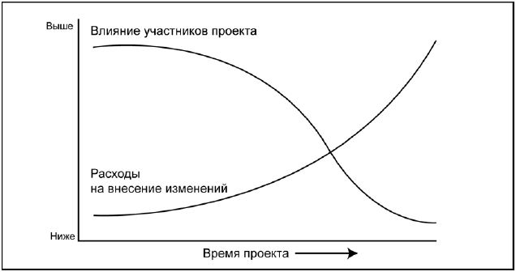
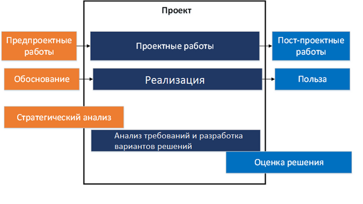
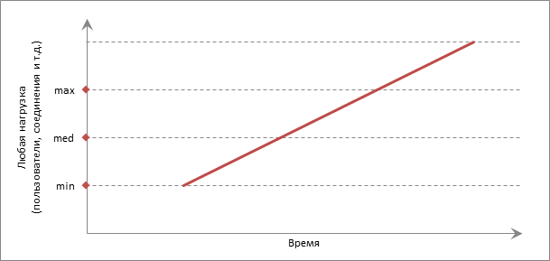
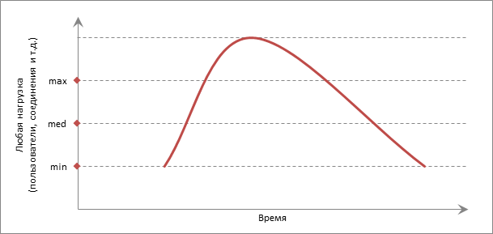
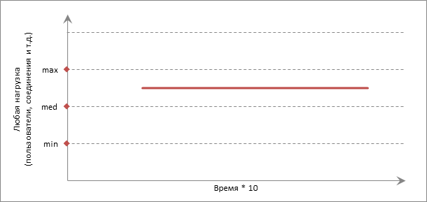
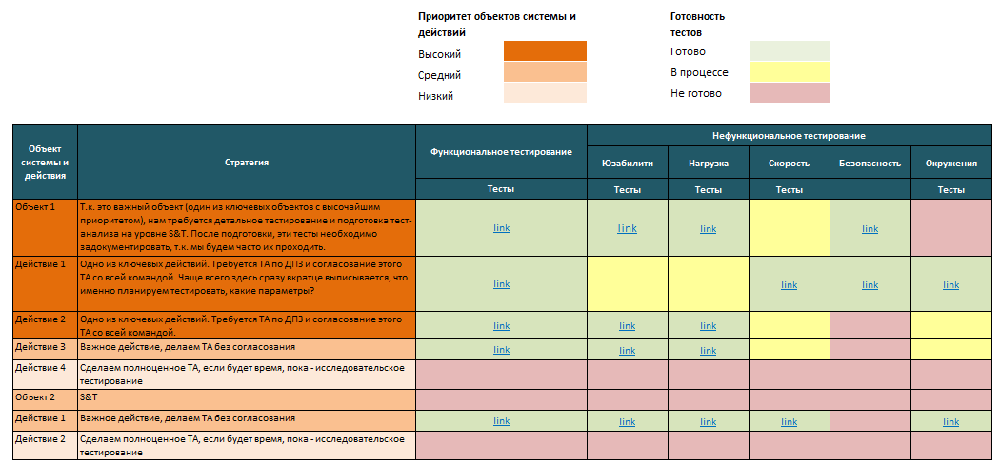
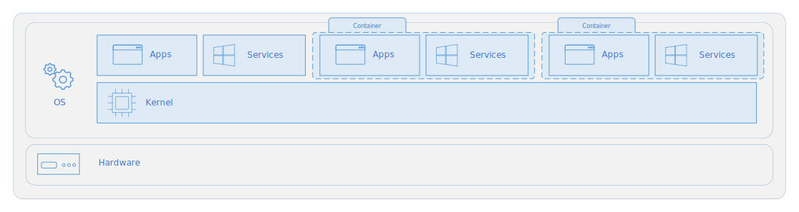
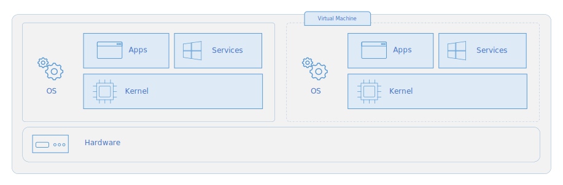

# **Теория тестирования**

## **Обязанности QA**
* изучение и уточнение требований к программе у заказчика (в больших проектах этим могут занимаются бизнес аналитики)
* написание и последующая доработка сценариев тестирования
* проведение тестирования функционала ПО
* внесение отчетов по обнаруженным недочетам в трекинговую систему
* анализ результатов и показателей проведенных тестов
* составление ТЗ на устранение найденных после тестирование недочетов
* мониторинг и отслеживание правок
* проведение повторных тестов на отсутствие найденных ошибок
* анализ и оптимизация этапов разработки для устранения причин ошибок и избежания повторного их появления
* работа с тестовой документацией


## **Что знаете о тестировании нагрузки? В каком случае следует проводить такое тестирование? На каком этапе готовности продукта**
*Нагрузочное тестирование (load testing)* - выполнение программы c повышением нагрузки, вплоть до достижения запланированных характеристик, и далее с отслеживанием поведения на всем протяжении повышения загрузки системы. При этом может происходить:
* измерение времени выполнения выбранных операций при определенных интенсивностях выполнения этих операций
* определение количества пользователей, одновременно работающих с приложением
* определение границ приемлемой производительности при увеличении нагрузки (при увеличении интенсивности выполнения этих операций)

Проводится в следующих случаях:
* новый проект, который ещё не проходил нагрузочного тестирования и настало время аудита производительности
* внедрили крупное изменение, которое существенно влияет на функционал
* планируется участие в крупных маркетинговых акциях, которые привлекут большой трафик
* изменение конфигурации стендов 
* оценка возможностей существующей системы

Обычно проводится заранее перед релизом или ожидаемым увеличеннием нагрузки.


## **Decision table и как её можно использовать**
*Таблица решений (Decision Table)* — техника, помогающая наглядно изобразить комбинаторику условий из ТЗ. Пример ниже.

> **СИ01. Найти товар и сделать покупку**
> 
> *Легенда*  
> П — пользователь  
> С — система
> 
> *Сценарий использования*
> 1. П открывает список товаров и фильтрует по категории.
> 2. С отображает товары выбранной категории.
> 3. П видит интересный товар и переходит на его карточку.
> 4. С отображает карточку товара, оценку покупателей и отзывы.
> 5. П изучает товар и кладет его в корзину.
> 6. С добавляет товар в корзину.
> 7. П переходит в корзину и оформляет заказ.
> 8. С сохраняет заказ, отправляет уведомление по email.
>
> *Альтернативные варианты*
> * 1а  П фильтрует список по несуществующей категории. Система выдает ошибку. Завершение сценария.
> * 2а. Товаров не найдено. Вывод сообщения об ошибке. Завершение сценария.
> * 2б. Товаров слишком много. Система выводит первые 100 и предлагает сузить поиск.
> * 5а. П возвращается к покупкам. Переход к шагу 1.
> 
> *Параметры*  
> Категории товаров: платья, джинсы, свитера.  
> Время хранения товара в резерве: 2 часа с момента добавления в корзину.


## **Что может быть критерими запуска и завершения тестирования**
В общем, бессмысленно абстрактно говорить о критериях начала или завершения тестирования, потому что оно начинается и завершается вместе с началом и концом всего проекта в целом.  
Более правильно говорить о тестировании как о подпроцессе процесса разработки ПО. Этот подпроцесс состоит из целой серии деятельностей, каждая из которых связана зависимостями с другими деятельностями, в том числе не относящимися к тестированию.

Критериями для начала тестирования могут быть выбраны:
* завершение функционала, который может быть протестирован
* достижение определённого этапа разработки

Критериями для остановки/завершения тестирования могут быть выбраны:
* истечение времени
* опустошение бюджета
* все тест кейсы пройдены, найденные баги исправлены и перепроверены


## **Примеры подходов для тестирования локализации**
**При наличии локали.**  
Берём локаль и проводим необходимый комплекс операций для проверки её качества.

**При отсутствии локали.**  
*Техника псевдо-локализации (Pseudo-localization approach)*. В рамках этого подхода нужно подготовить псевдо-локаль (сделать это может сам тестировщик), используя любой другой язык и добавив в файлы необходимые данные, например спец.символы определенного языка. Также можно добавить большее количество символов в строки, чтобы проверить будет ли обрезаться текст (truncate), ведь текст может стать длиннее после перевода на новую локаль и не вместиться в отведённое для него пространство. Ещё такой подход поможет найти проблему с объединением строк (concatenation) и проблемы, связанные с отображением шрифта, если таковые имеются. Для того, чтобы такие проблемы было проще найти, то в начало и конец строки можно добавить какой-нибудь символ. К примеру Microsoft использует такой подход ещё с 90х и вставляет квадратные скобки для обозначения начала и окончания строки.


## **A/B тестирование**
A/B-тестирование — эксперимент, который позволяет сравнить две версии чего-либо, чтобы проверить гипотезы и определить, какая версия лучше. Должны ли кнопки быть черными или белыми, какая навигация лучше, какой порядок прохождения регистрации меньше всего отпугивает пользователей..  
Пользователи случайным образом делятся на сегменты. Один из сегментов остается без изменений — это контрольный сегмент “A”, на основе данных по этому сегменту мы будем оценивать эффект от вносимых изменений. Пользователям из сегмента “B” показываем измененную версию. Чтобы получить статистически значимый результат, очень важно исключить влияние сегментов друг на друга.


## **Что такое mock/stub? Какие знаете инструменты для работы с ними**
*Тестовый двойник (Test Double)* - это всеобъемлющий термин, который описывает все виды фальшивых (fake) зависимостей, непригодных к использованию в конечном продукте (non-production-ready), в тестах. Такая зависимость выглядит и ведет себя как ее аналог, предназначенный для production, но на самом деле является упрощенной версией, которая снижает сложность и облегчает тестирование.

Видов тестовых двойников:
* Пустышка (dummy)
* Стаб (stub)
* Шпион (spy)
* Мок (mock)
* Фейк (fake)


Моки помогают имитировать и изучать исходящие (outcoming) взаимодействия. То есть вызовы, совершаемые тестируемой системой (SUT) к ее зависимостям для изменения их состояния.

Стабы помогают имитировать входящие (incoming) взаимодействия. То есть вызовы, совершаемые SUT к ее зависимостям для получения входных данных.


**Инструменты**  
*Java*: Mockito, EasyMock, JMockit  
*Python*: pyDoubles, Mox, Mockito-python


## **Когда нужно использовать технику Pairwise**
Когда у нас большее количество комбинаций тестовых данных и мы хотим обеспечить максимальное покрытие, протестировав все возможные отдельные комбинации каждой пары входных параметров.

## **Fuzz-тестирование и где его используют**
*Fuzz testing (фаззинг)* – методика тестирования, при которой на вход программы подаются невалидные, непредусмотренные или случайные данные. Основная идея такого подхода состоит в том, чтобы случайным образом “мутировать” ожидаемые программой входные данные в произвольных местах. Все фаззеры работают примерно одинаковым образом, позволяя задавать некоторые ограничения на мутирование входных данных определенными байтами или последовательностью байтов. Широко применяется там, где требуется высокая степень надёжности.  
Фаззинг можно применять к любым функциям, которые обрабатывают сложные данные. Например, библиотеки сжатия и распаковки, парсеры HTTPS и DNS, различные десериализаторы, мультимедиа кодеки, криптографические библиотеки, запросы к базам данных. А также для всего, что принимает данные из внешнего мира, то есть из недоверенных источников.

*Основные виды*:
* Случайный фаззинг каждый раз генерирует полностью случайные значения никак не зависящие от прошлых тестов. Случайные фаззеры являются более простыми и более быстрыми. Они могут дать хороший результат за малую цену.
* Фаззинг с учетом покрытия использует результаты прошлых тестов для отслеживания и последующего увеличения покрытия кода. Такие фаззеры могут углубляться в тестируемые данные и для работы таких фаззеров нужны наборы данных подаваемых на вход. Эти данные называются корпус - это минимальный набор тестовых входных данные, которые могут сгенерировать максимальное покрытие кода.


## **REgexp**
Регулярные выраже́ния (Regular Expressions/REgexp) — формальный язык, используемый для поиска и осуществления манипуляций с подстроками в тексте, основанный на использовании метасимволов (символов-джокеров/wildcard characters). Для поиска используется строка-образец (pattern/шаблон, маска), состоящая из символов и метасимволов и задающая правило поиска.


## **Как меняется стоимость дефекта при тестировании ПО**
Чем раньше найден дефект, тем дешевле нам обходится его исправление. Со временем, стоимость исправлений возрастает, в то время как влияние участников проекта на процесс разработки постепенно уменьшается.



Если серьезный дефект обнаруживается на поздних этапах разработки, он может остаться неисправленным, поскольку стоимость внесения изменений может оказаться слишком высокой. Кроме того, даже если готовая программа будет соответствовать спецификации, заказчик все равно может отказаться ее принимать, если сама спецификация была неправильной. Проектная команда могла разработать в точности то, что было описано в требованиях, но если требования были истолкованы неправильно, заказчика результат не устроит.


## **Каковы пути анализа бизнеса клиента? Как определить целесообразность того или иного функционала**



*Предпроектые работы (Discovery/Solution Design)* — фаза, на которой проводится обоснование целесообразности старта разработки.
* Понять текущее состояние бизнеса, его проблемы или возможности, которых ему не хватает.
* Понять, что именно бизнес-хочет получить по результатам разработки и внедрения решения.
* Определить подходы к решению выявленных проблем и выбрать из них тот, который приносит максимальную ценность для заказчика.
* Определить на высоком уровне границы решения и критерии успеха.

*Проектые работы* — фаза, на которой идет активная разработка и тестирование.
* Выявить, описать и согласовать детальные требования к решению.
* Управлять изменениями требований.
* Проводить приоритизацию требований.
* Организовать приемочное тестирование.

*Постпроектые работы* — фаза оценки полученной ценности/пользы.
* Оценить полученный результат.
* Обработать замечания и предложения, полученные по результатам эксплуатации.
* Обновить базу знаний по проекту.


## **Какое должно быть процентное соотношение между позитивным и негативным тестированием на проекте**
Все требования должны быть покрыты позитивными сценариями, плюс стоит делать минимум хотя бы один-два негативных сценария на каждое требование.


## **Есть ли разница между bug leakage и bug release**
*Bug release* — баги, которые были выпущены в релиз и команда разработки о них знает.

*Bug leakage* — неизвестные команде разработки, баги, которые находят пользователи после релиза.


## **Что нужно покрывать тест-кейсами, а что считается избыточным расходом времени и денег? Когда нецелесообразно писать тест-кейсы**
В первую очередь тестами покрывается основной функционал приложения и далее по нисходящей. Однако тест-кейсы пишутся отталкиваясь от требований бизнеса. Возможно, что требования бизнеса к тестированию не будут покрывать основной функционал. В такой ситуации требуется уточнение требований у заказчика.


## **Как посчитать Cyclomatic complexity**
Цикломатическая сложность программы (Cyclomatic Complexity of a Program) — структурная/топологическая мера сложности компьютерной программы. Разработана Томасом Дж.Маккейбом в 1976 году.  
При вычислении цикломатической сложности используется граф потока управления программы. Узлы графа соответствуют неделимым группам команд программы, они соединены ориентированными рёбрами, если группа команд, соответствующая второму узлу, может быть выполнена непосредственно после группы команд первого узла. Цикломатическая сложность может быть также вычислена для отдельных функций, модулей, методов или классов в пределах программы.  
Ей на замену пришла Cognitive Complexity разработанная в 2017 году компанией Sonar Source.


## **В чем основная разница между defect detection percentage и defect removal efficiency**
*Процент обнаружения дефектов (Defect Detection Percentage/DDP или Defect Removal Efficiency/DRE)* - процент обнаружения дефектов показывает меру эффективности тестирования. Рассчитывается как отношение дефектов, обнаруженных до выпуска и после выпуска ПО. DDP можно определить в виде следующей формулы:

    DDP = (Количество дефектов на момент выпуска версии ПО / Общее количество дефектов выявленных командой тестирования и заказчиками) * 100

*Эффективность обнаружения дефектов (Defect Detection Efficiency/DDE)* - параметр, который рассчитывается для обеспечения качества и эффективности ПО. Это количество дефектов или ошибок, которые были созданы и были обнаружены на одном этапе разработки, и деленное на общее количество ошибок, созданых на этом этапе. Отброшенные дефекты не учитываются. DDE можно рассчитать на любом этапе жизненного цикла разработки ПО (SDLC), когда дефекты могут быть созданы и обнаружены. Фаза, в которую создан дефект, определяется путем анализа. DDE можно определить в виде следующей формулы:

    DDE = (Количество дефектов, созданных и обнаруженных на этапе / Общее количество дефектов, созданных на этом этапе) * 100


## **Какие модели risk-based testing вы знаете**
*FMEA(Failure Mode and Effect Analysis)* - является наиболее популярным подходом к тестированию основанному на рисках. Это модель анализа причин и последствий отказов системы, которая определяет потенциальные дефекты и причины их возникновения. Работа по такой модели подразумевает, что команда проекта пробует определить все компоненты, процессы, модули, в которых может произойти сбой. Этот сбой с различной долей вероятности может привести к ухудшению качества ПО. Для измерения таких сбоев используются 3 показателя: серьезность, приоритет и вероятность. Каждому риску назначается Risk Priority Number (RPN) и в зависимости от показателей закладывается глубина тестирования.


## **Тестирование API? Инструменты**
*API (программный интерфейс приложения)* – набор процедур, протоколов и инструментов для создания программных приложений. API определяет, как приложение должно взаимодействовать с другими программами. 

Тестирование API предполагает проверку правильности этих взаимодействий.

**Инструменты**:
Swagger, SoapUI, Postman


## **Load, Stress и Stability testing? Какими инструментами пользуются для их выполнения**
*Нагрузочное тестирование (load testing)* - выполнение программы c повышением нагрузки, вплоть до достижения запланированных характеристик, и далее с отслеживанием поведения на всем протяжении повышения загрузки системы.  


*Стрессовое тестирование (stress testing)* - тестирование, оценивающее систему на граничных значениях рабочих нагрузок или за их пределами, или же в состоянии ограниченных ресурсов, таких как память или доступ к серверу.  


*Тестирование стабильности (stability testing)* - проверка работоспособности приложения при длительном (многочасовом) тестировании со средним уровнем нагрузки. Времена выполнения операций могут играть в данном виде тестирования второстепенную роль. При этом на первое место выходит отсутствие утечек памяти, перезапусков серверов под нагрузкой и т.д.  


**Инструменты**:
LoadRunner, Apache JMeter, Gatling

<br>
<br>

# **AQA (Automation QA)**

# *Selenium*

## **Как вы будете строить и внедрять стратегию по автоматизации тестирования**
https://habr.com/ru/post/275171/

3 варианта стратегий, характерных для самого начала развёртывания автоматизации.

***1. Стратегия «Let's try»***  
Применяется в том случае, когда АТ ни на проекте, ни в компании по сути никогда не было, и планируется осторожный старт с умеренным выделением ресурсов.

Имеет смысл применять в случае, когда:
* Отсутствуют точные цели автоматизации (покрыть 40% кода конкретного модуля к определённой дате, уменьшение расходов на ручное тестирование и т.д.).
* АТ на проекте ранее никогда не применялась.
* У тестировщиков отсутствует (или очень мал) опыт АТ.
* Выделенные ресурсы умеренны или низки.

Описание стратегии:
* Больше внимания уделять подготовительным этапам тестирования (составление тест-планов, тест-кейсов и т.д.).
* Больше внимания уделять инструментам, которые можно использовать как помощь в ручном тестировании.
* Больше экспериментировать с технологиями и методологиями АТ. Никто не ждёт срочных результатов и можно экспериментировать.
* Работать с проектом, начиная с верхнего уровня, в начале не углубляясь в автоматизацию конкретных модулей.

***2. Стратегия «Here the target»***  
Особенностью стратегии служит ориентирование на конкретный результат. Выбирается/определяется цель нового этапа АТ, и задачи ориентируются на достижения данного результата.

Имеет смысл применять в случае, когда:
* Когда на проекте уже проведена предварительная работа, имеется какой-то бэкграунд в виде тест-планов, тест-кейсов, автотестов предыдущего этапа АТ.
* Есть конкретная цель АТ (не глобальная — 80% автотестов за полгода, а скорее 50% автотестов конкретного модуля за месяц)
* Для выполнения конкретной цели выбраны конкретные инструменты, оптимально если у специалистов имеется некий технический бэкграунд по работе с инструментами.

Описание стратегии:
* Поступательная стратегия, чем-то напоминающая Agile методологии разработки. Движение вперёд этапами. Покрытие автотестами модуля за модулем, до полного выполнения мета задач вида (80% за полгода).
* На каждый этап выставляется новая цель (вероятнее всего продолжающая последнюю выполненную цель, но не обязательно), и выбираются инструменты для реализация данной цели.
* Глубокая фокусировка на конкретной цели, написание тест-кейсов, автотестов, не для всего проекта, а исключительно под конкретную задачу.

***1.3 Стратегия «Operation Uranum»***  
По сути, стратегия — постоянная и методичная работа над АТ по выставляемым раз в 2-3 недели приоритетам. Оптимально — наличие постоянно работающего именно над автоматизацией человека, не особенно отвлекающегося на сторонние задачи.

Имеет смысл применять в случае, когда:
* Отсутствуют конкретные цели, есть лишь общее пожелание «чтоб всё было хорошо». Если «Here the target» напоминает по принципу работы Agile, то данная стратегия близка по духу к методологии Waterfall.
* Есть ресурс в виде хотя бы одного постоянно действующего на проекте человека, плотно занятого задачей автоматизации.
* Нет чётко выраженных целей АТ, однако есть пожелания (приоритеты), которые можно выставить на достаточно продолжительный период времени (данные модули более важны, нежели те, больше ошибок традиционно в бэкэнде/фронтэнде, потому большие усилия стоит направить на него).

Описание стратегии:
* Идея стратегии описана выше, постоянная и методичная работа с учётом выставленных приоритетов.
* В начале нужен упор в базовую часть, поскольку так или иначе в рамках данной стратегии автоматизируется весь проект, без полной фокусировки на конкретных модулях.

Стратегия может быть представлена как в виде традиционно расписанного документа, так и в более наглядном формате


## **Как обрабатывать браузерные сообщения (alerts)**
```java
Alert alert = driver.switchTo().alert();
alert.getText(); 
alert.sendkeys(String stringToSend); 
alert.accept(); / alert.dismiss();
```

## **Концепция дизайна Appium**
Appium — HTTP-сервер, написанный на платформе Node.js, который управляет сессиями iOS и Android, используя проводной протокол WebSON JSON. Следовательно, перед инициализацией сервера Appium Node.js должен быть предварительно установлен в системе.  
Когда Appium загружен и установлен, на нашем компьютере настраивается сервер, который предоставляет REST API.  
Он получает запрос на подключение и команду от клиента и выполняет эту команду на мобильных устройствах (Android / iOS)  
Он отвечает HTTP-ответами. Опять же, чтобы выполнить этот запрос, он использует платформы автоматизации мобильных тестов для управления пользовательским интерфейсом приложений.  
Ограничения:
* Инструменты Apple для iOS (инструменты доступны только в Xcode 3.0 или более позднейверсии с OS X v10.5 и более поздней версии)
* Google UIAutomator для Android API уровня 16 или выше
* Selendroid для Android API уровня 15 или ниже


## **Electron? Как использовать Selenium для тестирования приложений на его основе**
*Electron* — это фреймворк для разработки настольных приложений с использованием HTML, CSS и JavaScript. Такие приложения могут работать на различных платформах. Среди них — Windows, Mac и Linux.  
В основе Electron лежат проекты Chromium и Node.js, объединённые в единую среду, обеспечивающую работу приложений. Это даёт возможность применять веб-технологии при разработке настольных программ.

*JS пример для теста Electron приложения с использованием Selenium*:
```js
const webdriver = require('selenium-webdriver')
const driver = new webdriver.Builder()
  // The "9515" is the port opened by ChromeDriver.
  .usingServer('http://localhost:9515')
  .withCapabilities({
    'goog:chromeOptions': {
      // Here is the path to your Electron binary.
      binary: '/Path-to-Your-App.app/Contents/MacOS/Electron'
    }
  })
  // note: use .forBrowser('electron') for selenium-webdriver <= 3.6.0
  .forBrowser('chrome')
  .build()
driver.get('http://www.google.com')
driver.quit()
```


# *Тестовая инфраструктура*

## **Что такое и чем отличаются виртуальная машина, симулятор и эмулятор**
*Виртуализация* – сокрытие конкретной реализации за универсальным стандартизованным методом обращения к ресурсам. Иными словами, это создание абстракции над аппаратным обеспечением.

*Полная эмуляция (симуляция)* - виртуальная машина полностью виртуализует все аппаратное обеспечение при сохранении гостевой ОС в неизменном виде. Такой подход позволяет эмулировать различные аппаратные архитектуры. Основной минус данного подхода заключается в высокой ресурсозатратности.

*Частичная эмуляция (нативная виртуализация)* -  виртуальная машина виртуализует лишь необходимое количество аппаратного обеспечения, чтобы она могла быть запущена изолированно. Этот вид виртуализации позволяет существенно увеличить быстродействие гостевых систем, приближая его к быстродействию физической платформы, за счёт применения гипервизора, являющегося связующим звеном между гостевыми системами и аппаратурой.

*Гипервизор (Virtual Machine Monitor/Монитор виртуальных машин)* - специальная «прослойка» между гостевой ОС и оборудованием, позволяющая гостевой системе напрямую обращаться к ресурсам аппаратного обеспечения.


## **Контейнер и чем он отличается от виртуальной машины**
*Контейнер* — это абстракция на уровне приложения, объединяющая код и зависимости. Контейнеры реализуются поверх ядра ОС узла (которое можно считать своеобразным фундаментом ОС) и содержат только приложения и некоторые API-интерфейсы и службы ОС, работающие в пользовательском режиме.  
В отличие от контейнеров, виртуальные машины работают под управлением полноценной ОС с собственным ядром.  
**Архитектура контейнера**

**Архитектура виртуальной машины**



## **IaaS и PaaS? Примеры использования.**
*IaaS (Infrastructure as a Service/инфраструктура как услуга)*. Сюда относят вычислительные ресурсы: виртуальные серверы, хранилища, сети. Это что-то вроде виртуальных «компьютеров», на которые можно установить что угодно: ОС, ПО, приложения.  
Поставщик IaaS (инфраструктуры как сервиса), или облачный провайдер, уже все купил и собрал, обеспечил серверы электричеством и интернетом. Вам остается только подключиться к этим вычислительным мощностям через интернет и использовать их для своих целей.  
**Примеры IaaS**:
* Перенос IT-систем в облако
* Экономия на инфраструктуре
* Быстрый запуск бизнеса
* Расширение инфраструктуры
* Инфраструктура для компаний со скачками спроса
* Разработка и тестирование

*PaaS (Platform as a Service/платформа как услуга)* - уже настроенные инструменты (платформы) под разные задачи.  
Ключевое отличие PaaS от IaaS в том, что здесь у вас есть определенные инструменты, например: система управления БД, среда машинного обучения или обработки big data. Их нужно настроить под потребности компании, но не надо строить с нуля. Что позволяет экономить время разработчиков. Например, не нужно возиться с разработкой БД, можно просто загрузить в нее информацию и работать.  
При этом нет доступа к ОС, настройкам виртуальных серверов, которые лежат в основе PaaS, а также к низкоуровневым настройкам самой платформы. Провайдер берет на себя их оптимальную конфигурацию и снимает с вас необходимость следить за настройками, обновлениями, масштабированием и безопасностью. Вы получаете доступ только к интерфейсам самой платформы.  
**Примеры PaaS**:
* БД
* Разработка приложений в контейнерах
* Аналитика больших данных
* Машинное обучение

*SaaS (Software as a Service/программное обеспечение как сервис)* — полностью настроенная и готовая к работе программа, выполняющая определенные функции. Единственное отличие технологии SaaS от программы на смартфоне или компьютере в том, что сам софт находится в облаке.  
**Примеры SaaS**:
* электронная почта
* CRM-системы
* планировщики задач
* веб-конструкторы для создания сайтов
* платформы для ведения блогов


## **Configuration Management**
*Configuration Management (управление конфигурацией проекта)* – идентификация, создание, поддержание и контроль конфигурации в ходе проекта.  
**Основная задача**: в любом момент времени иметь доступ к 100% актуальной версии конфигурационного элемента, которые необходимо использовать, и быть уверенным, что ни один конфигурационный элемент не конфликтует с другими конфигурационными элементами.  
**Этапы**:
1. Идентификация конфигурации проекта и создание начальной (базовой) конфигурации проекта
   * Начальная конфигурация продукта
   * Начальная конфигурация проекта
2. Разработка плана управления конфигурацией проекта
3. Контроль конфигурации в ходе проекта


## **SSH и как им пользоваться**
*SSH(Secure Shell)* - протокол удаленного управления компьютером с ОС Linux. В основном ssh используется для удаленного управления серверами через терминал, но может использоваться для доступа к любым устройствам с ОС Linux.
**Подключиться**:
```shell
$ ssh user@host
```


## **Bash и Batch скрипты? Зачем их используют**
*Bash-скрипты (shell script)* — сценарии командной строки, написанные для оболочки bash для Unix-подобных ОС.  
*Batch-файл (пакетный файл/батник)* — сценарии командной строки, в MS-DOS, OS/2 или Windows.

*Сценарии командной строки* — наборы тех же самых команд, которые можно вводить с клавиатуры, собранные в файлы и объединённые некоей общей целью. При этом результаты работы команд могут представлять либо самостоятельную ценность, либо служить входными данными для других команд. Являются мощным способом автоматизации часто выполняемых действий.


# *Web*

## **Разница между авторизацией и аутентификацией**
*Идентификация* — процедура, в результате выполнения которой для субъекта идентификации выявляется его идентификатор, однозначно определяющий этого субъекта в информационной системе.

*Аутентификация* — процедура проверки подлинности, например проверка подлинности пользователя путем сравнения введенного им пароля с паролем сохраненным в базе данных.

*Авторизация* — предоставление определенному лицу или группе лиц прав на выполнение определенных действий.

**Пример**:
* пользователь указывает логин -> система распознает его как существующий (***идентификация***)
* пользователь вводит пароль -> пароль совпал -> система соглашается, что пользователь, похоже, действительно настоящий (***аутентификация***)
* пользователь правильно вводит дополнительный одноразовый код -> система окончательно соглашается, что это настоящий владелец аккаунта (***двухфакторная аутентификация***)
* система предоставит пользователю право читать письма в его почтовом ящике (***авторизация***)


## **Может ли сервер отправить код 400, если проблема на его стороне**
*400 (Bad Request)* - напрямую связан с клиентом (браузером, к примеру) и намекает на то, что отправленный запрос со стороны пользователя приводит к сбою еще до того, как его обработает сервер, по крайней мере так считает сам сервер. Зачастую сервер отправляет этот код, когда появившаяся неисправность не подходит больше ни под одну категорию ошибок.  
**Из-за чего всплывает Bad Request**:
1. Некорректно настроенные HTTP-заголовки в запросе. Некоторые приложения и сайты мониторят заголовки на предмет наличия в них чего-нибудь подозрительного. Если запрос не соответствует ожиданиям сервера, то высока вероятность появления ошибки 400 (это не всегда вина пользователя).
2. Если клиент пытается загрузить на сервер файл слишком большого размера. На большинстве сайтов есть ограничения по размеру загружаемых данных. Причем ограничение может быть как в 2 гигабайта, так и в 600 килобайт.
3. Пользователь пытается получить доступ к несуществующей странице. То есть в браузер банально ввели ссылку с опечаткой, некорректным доменом или поддоменом.
4. Устаревшие или измененные куки-файлы. Сервер может воспринять подмену куки-файлов как попытку атаковать или воспользоваться дырой в безопасности. Такие запросы сходу блокируются.


## **Как проверить обрыв соединения WebSocket**
```js

//Свойство
socket.readyState
```
* 0 – CONNECTING - соединение ещё не установлено
* 1 – OPEN - обмен данными
* 2 – CLOSING - соединение закрывается
* 3 – CLOSED - соединение закрыто


## **Основные виды уязвимости веб-приложений**
* *Инъекции*. Уязвимости подобного класса начинаются SQL-инъекциями, в различных вариациях, и замыкаются RCE — удаленным выполнением кода.
* *XSS (Межсайтовый скриптинг)* — уязвимость, встречающаяся на данный момент куда реже, чем раньше, но несмотря на это не стала менее опасной. Особенно для пользователей, ведь атака XSS нацелена именно на них. В общем случае злоумышленник внедряет скрипт в веб-приложение, который срабатывает для каждого пользователя, посетившего вредоносную страницу.
* *LFI/RFI*. Уязвимости данного класса позволяют злоумышленникам через браузер включать локальные и удаленные файлы на сервере в ответ от веб-приложения. Эта брешь присутствует там, где отсутствует корректная обработка входных данных, которой может манипулировать злоумышленник, инжектировать символы типа path traversal и включать другие файлы с веб-сервера.
* *JSON Injection* - Простая инъекция JSON на стороне сервера может быть выполнена для похищения cookie.
* *JSON Hijacking (Захват JSON)* — атака, в некотором смысле похожая на подделку межсайтовых запросов (CSRF), при которой злоумышленник старается перехватить данные JSON, отправленные веб-приложению с веб-сервера.
* *Атака внешней сущности XML (XML External Entity/XXE)* — тип атаки, в котором используется широко доступная, но редко используемая функция синтаксических анализаторов XML. Используя XXE, злоумышленник может вызвать отказ в обслуживании (DoS), а также получить доступ к локальному и удаленному контенту и службам. XXE может использоваться для выполнения подделки запросов на стороне сервера (SSRF), заставляя веб-приложение выполнять запросы к другим приложениям. В некоторых случаях c помощью XXE может даже выполнить сканирование портов и удаленное выполнение кода.


## **Какие инструменты для тестирования Web performance client-side знаете**
***Playwright with Lighthouse***  
https://nuancesprog.ru/p/15590/


## **Cниферы? Какие знаете**
*Анализатор трафика (sniffer/сниффер)* — программа или устройство для перехвата и анализа сетевого трафика (своего и/или чужого).
**Виды**:
* аппаратные
* программные
* аппаратно-программные
* онлайн-апплеты

**Известные снифферы**
* Wireshark/Ethereal
* ZxSniffer
* IRIS


## **Разница между DROP и TRUNCATE**
**Команды SQL**  
https://tproger.ru/translations/sql-recap/

*DROP (DDL команда)* - для удаления структуры таблицы. Удалит также все индексы, строки, ограничения и триггеры таблицы. Функции и хранимые процедуры, которые зависят от таблицы, останутся, но станут недействительными. Триггеры DML не срабатывают. Откат не поддерживается. Не может использоваться с оператором WHERE.

*DELETE (DML команда)* - удаляет одну или несколько строк из таблицы или представления, при этом эта операция всегда полностью регистрируется в журнале транзакций, т.е. каждая удаленная строка. Выполняется с использованием блокировки каждой удаляемой строки. Может активировать триггер. Поддержка отката. Может использоваться с выражением WHERE.

*TRUNCATE (DDL команда)* - удаляет все строки в таблице, не записывая в журнал транзакций удаление отдельных строк данных. Удалит все данные в таблице, но не удалит структуру таблицы. При удалении всех записей блокируется вся таблица. Не может использоваться с оператором where. Откат не поддерживается.  
TRUNCATE TABLE похожа на инструкцию DELETE без предложения WHERE, но она выполняется быстрее и требует меньше ресурсов.


## **Функция CASE**
*CASE* проверяет истинность набора условий и в зависимости от результата проверки может возвращать тот или иной результат.

Имеет два формата (оба поддерживают дополнительный аргумент ELSE):
* простое выражение CASE для определения результата сравнивает выражение с набором простых выражений
* поисковое выражение CASE для определения результата вычисляет набор логических выражений


## **Что такое collation**
*Collation* - параметр указывает SQL серверу, как нужно сортировать и сравнивать строки. Например, разные или нет строки “Apple” и “apple” зависит от указанного Collation.


## **Что такое схема GraphQL**
*GraphQL Schema* – описание типов данных на сервере, связей между ними и логики получения этих самых данных.
**Включает в себя параметры**:
* *query* - для операций получения данных
* *mutation* - для операций изменения данных
* *subscription* - для подписки на события

Обязательным параметром является только query, без него схема просто не запустится.  
**Состояние операций в GraphQL**:
* *stateless* - все операции в query и mutation должны быть без состояния, т.е. если в кластере много машин обслуживающих запросы клиентов, то неважно на какой из серверов прилетел запрос. Его может выполнить любая нода.
* *statefull* - должно быть у операций subscription, т.к. требуется установка постоянного подключения с клиентом, хранение данных о подписках, механизм переподключения и восстановления данных о существующих подписках. Пакет graphql никак не помогает в решении этих админских проблем.


## **Разница между OLTP и OLAP**
*OLTP (Online Transaction Processing/оперативная обработка транзакций)* - метод проведения транзакций в режиме реального времени с использованием онлайновой БД, которая автоматически обновляется по мере совершения транзакций. Такие предприятия, как банки, отели и рестораны, часто используют OLTP, чтобы их сотрудники и клиенты могли одновременно и эффективно выполнять несколько транзакций в реальном времени, сохраняя при этом точность данных. По мере совершения транзакций системы OLTP автоматически обновляют остатки на счетах и ​​сохраняют другую важную информацию, такую ​​как дата и время. Обычно это реляционные БД.

*OLAP (Online Analytical Processing/оперативная аналитическая обработка)* - сервис для анализа большого объема данных по нескольким измерениям. Здесь измерение относится к элементу определенного набора данных. Например, если компания владеет данными о своих рекламных кампаниях, включая такие элементы, как воздействие на потребителей, продолжительность рекламы, доход от продукта и стоимость рекламы, она может использовать OLAP для сортировки и анализа данных по каждому элементу. Предприятия часто используют OLAP для сложных аналитических расчетов, интеллектуального анализа данных, финансового анализа, составления бюджета и прогнозирования. Обычно это многомерные БД.

*Нормализация* - подразумевает хранение информации максимально просто и не избыточно.  
Максимально просто: не хранить в одном столбце ФИО, а сделать 3 отдельных.  
Не избыточно: фамилия клиента должна храниться только в справочнике клиентов, и ее не нужно добавлять в сделанные клиентом заказы.  
*Денормализация* - процесс противоположный нормализации.

**Ключевые различия**:
* OLAP – категория программных инструментов, которые анализируют данные, хранящиеся в БД, тогда как OLTP поддерживает ориентированные на транзакции приложения в трехуровневой архитектуре.
* OLAP создает единую платформу для всех типов потребностей бизнес-анализа, которая включает планирование, бюджетирование, прогнозирование и анализ, а OLTP полезен для администрирования повседневных транзакций организации.
* OLAP характеризуется большим объемом данных, тогда как OLTP характеризуется большим количеством коротких онлайн-транзакций.
* В OLAP хранилище данных создается уникальным образом, чтобы в него можно было интегрировать разные источники данных для построения консолидированной БД, тогда как OLTP использует традиционные СУБД.


## **Типы репликации в SQL Server?**
*Репликация* - набор технологий копирования и распространения данных и объектов БД между БД, а также синхронизации БД для поддержания согласованности.

* Репликация транзакций - изменения на издателе доставляются подписчику по мере их появления (почти в реальном времени). Изменения данных применяются на подписчике в том же порядке и в тех же рамках транзакций, в которых они выполнялись у издателя.
* Репликация слиянием - данные можно изменять как на издателе, так и на подписчике, а также отслеживать с помощью триггеров. Подписчик синхронизируется с издателем при подключении к сети и обменивается с ним всеми строками, которые изменились со времени последней синхронизации издателя и подписчика.
* Репликация моментальных снимков - моментальный снимок издателя применяется к подписчику. Данные распространяются точно в том виде, в котором они были представлены в определенный момент времени. Обновление данных не отслеживается. Во время синхронизации формируется моментальный снимок и отсылается подписчикам целиком.
* Одноранговая репликация - основанна на репликации транзакций, распространяет согласованные на уровне транзакций изменения между несколькими экземплярами сервера почти в реальном времени.
* Двунаправленная репликация - представляет собой особую топологию репликации транзакций, которая позволяет двум серверам обмениваться изменениями друг с другом: каждый сервер публикует данные, после чего подписывается на публикацию с теми же данными от другого сервера.
* Обновляемые подписки - основаны на репликации транзакций. Когда данные для обновляемой подписки обновляются на подписчике, они сначала распространяются на издателя, а затем на других подписчиков.


## **Self Join**
*SELF JOIN* - используется для объединения таблицы с ней самой таким образом, будто это две разные таблицы, временно переименовывая одну из них. Нужен тогда, когда у разных полей одной таблицы могут быть одинаковые значения. Например, один и тот же участник музыкальной группы может быть и вокалистом, и, например, клавишником.